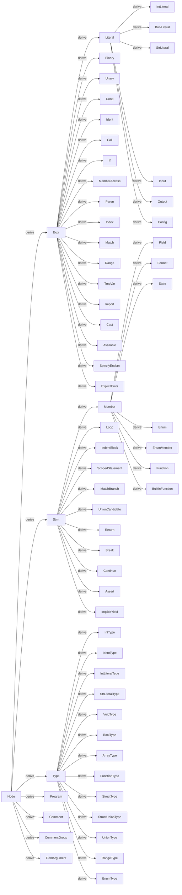

# AST

brgen(lang) の AST

基本の継承関係

```
Node
|        |      |
Expr     Stmt   Type
|        |
Literal  Member
```

継承関係のみ(zoom 可)



継承関係+保持関係(zoom 可)
TODO(on-keyday): ぐちゃぐちゃすぎるのでどうにかしたい

```mermaid
erDiagram
NodeType {
NodeType program
NodeType comment
NodeType comment_group
NodeType field_argument
NodeType expr
NodeType binary
NodeType unary
NodeType cond
NodeType ident
NodeType call_
NodeType if
NodeType member_access
NodeType paren
NodeType index
NodeType match
NodeType range
NodeType tmp_var
NodeType import
NodeType cast
NodeType available
NodeType specify_endian
NodeType explicit_error
NodeType stmt
NodeType loop
NodeType indent_block
NodeType scoped_statement
NodeType match_branch
NodeType union_candidate
NodeType return
NodeType break
NodeType continue
NodeType assert
NodeType implicit_yield
NodeType type
NodeType int_type
NodeType ident_type
NodeType int_literal_type
NodeType str_literal_type
NodeType void_type
NodeType bool_type
NodeType array_type
NodeType function_type
NodeType struct_type
NodeType struct_union_type
NodeType union_type
NodeType range_type
NodeType enum_type
NodeType literal
NodeType int_literal
NodeType bool_literal
NodeType str_literal
NodeType input
NodeType output
NodeType config
NodeType member
NodeType field
NodeType format
NodeType state
NodeType enum
NodeType enum_member
NodeType function
NodeType builtin_function
}
TokenTag {
TokenTag indent
TokenTag space
TokenTag line
TokenTag punct
TokenTag int_literal
TokenTag bool_literal
TokenTag str_literal
TokenTag keyword
TokenTag ident
TokenTag comment
TokenTag error
TokenTag unknown
}
UnaryOp {
UnaryOp not
UnaryOp minus_sign
}
BinaryOp {
BinaryOp mul
BinaryOp div
BinaryOp mod
BinaryOp left_arithmetic_shift
BinaryOp right_arithmetic_shift
BinaryOp left_logical_shift
BinaryOp right_logical_shift
BinaryOp bit_and
BinaryOp add
BinaryOp sub
BinaryOp bit_or
BinaryOp bit_xor
BinaryOp equal
BinaryOp not_equal
BinaryOp less
BinaryOp less_or_eq
BinaryOp grater
BinaryOp grater_or_eq
BinaryOp logical_and
BinaryOp logical_or
BinaryOp cond_op_1
BinaryOp cond_op_2
BinaryOp range_exclusive
BinaryOp range_inclusive
BinaryOp assign
BinaryOp define_assign
BinaryOp const_assign
BinaryOp add_assign
BinaryOp sub_assign
BinaryOp mul_assign
BinaryOp div_assign
BinaryOp mod_assign
BinaryOp left_shift_assign
BinaryOp right_shift_assign
BinaryOp bit_and_assign
BinaryOp bit_or_assign
BinaryOp bit_xor_assign
BinaryOp comma
}
IdentUsage {
IdentUsage unknown
IdentUsage reference
IdentUsage define_variable
IdentUsage define_const
IdentUsage define_field
IdentUsage define_format
IdentUsage define_state
IdentUsage define_enum
IdentUsage define_enum_member
IdentUsage define_fn
IdentUsage define_cast_fn
IdentUsage define_arg
IdentUsage reference_type
IdentUsage reference_member
IdentUsage maybe_type
IdentUsage reference_builtin_fn
}
Endian {
Endian unspec
Endian big
Endian little
}
ConstantLevel {
ConstantLevel unknown
ConstantLevel constant
ConstantLevel const_variable
ConstantLevel variable
}
BitAlignment {
BitAlignment byte_aligned
BitAlignment bit_1
BitAlignment bit_2
BitAlignment bit_3
BitAlignment bit_4
BitAlignment bit_5
BitAlignment bit_6
BitAlignment bit_7
BitAlignment not_target
BitAlignment not_decidable
}
Follow {
Follow unknown
Follow end_
Follow fixed
Follow constant
Follow normal
}
Node {
Loc loc
}
Node |o--|| Loc : strong
Expr {
Type expr_type
ConstantLevel constant_level
}
Node |o--|| Expr : derive
Expr |o--|| Type : strong
Expr |o--|| ConstantLevel : strong
Stmt {
}
Node |o--|| Stmt : derive
Type {
boolean is_explicit
boolean is_int_set
BitAlignment bit_alignment
number bit_size
}
Node |o--|| Type : derive
Type |o--|| boolean : strong
Type |o--|| boolean : strong
Type |o--|| BitAlignment : strong
Type |o--|| number : strong
Literal {
}
Expr |o--|| Literal : derive
Member {
Member belong
StructType belong_struct
Ident ident
}
Stmt |o--|| Member : derive
Member |o--|| Member : weak
Member |o--|| StructType : weak
Member |o--|| Ident : strong
Node |o--|| Program : derive
Program {
StructType struct_type
Node[] elements
Scope global_scope
}
Program |o--||StructType : strong
Program |o--||Node : strong
Program |o--||Scope : strong
Node |o--|| Comment : derive
Comment {
string comment
}
Comment |o--||string : strong
Node |o--|| CommentGroup : derive
CommentGroup {
Comment[] comments
}
CommentGroup |o--||Comment : strong
Node |o--|| FieldArgument : derive
FieldArgument {
Expr raw_arguments
Loc end_loc
Expr[] collected_arguments
Expr[] arguments
Expr alignment
number alignment_value
Expr sub_byte_length
Expr sub_byte_begin
}
FieldArgument |o--||Expr : strong
FieldArgument |o--||Loc : strong
FieldArgument |o--||Expr : weak
FieldArgument |o--||Expr : strong
FieldArgument |o--||Expr : strong
FieldArgument |o--||number : strong
FieldArgument |o--||Expr : strong
FieldArgument |o--||Expr : strong
Expr |o--|| Binary : derive
Binary {
BinaryOp op
Expr left
Expr right
}
Binary |o--||BinaryOp : strong
Binary |o--||Expr : strong
Binary |o--||Expr : strong
Expr |o--|| Unary : derive
Unary {
UnaryOp op
Expr expr
}
Unary |o--||UnaryOp : strong
Unary |o--||Expr : strong
Expr |o--|| Cond : derive
Cond {
Expr cond
Expr then
Loc els_loc
Expr els
}
Cond |o--||Expr : strong
Cond |o--||Expr : strong
Cond |o--||Loc : strong
Cond |o--||Expr : strong
Expr |o--|| Ident : derive
Ident {
string ident
IdentUsage usage
Node base
Scope scope
}
Ident |o--||string : strong
Ident |o--||IdentUsage : strong
Ident |o--||Node : weak
Ident |o--||Scope : strong
Expr |o--|| Call : derive
Call {
Expr callee
Expr raw_arguments
Expr[] arguments
Loc end_loc
}
Call |o--||Expr : strong
Call |o--||Expr : strong
Call |o--||Expr : strong
Call |o--||Loc : strong
Expr |o--|| If : derive
If {
Scope cond_scope
Expr cond
IndentBlock then
Node els
}
If |o--||Scope : strong
If |o--||Expr : strong
If |o--||IndentBlock : strong
If |o--||Node : strong
Expr |o--|| MemberAccess : derive
MemberAccess {
Expr target
Ident member
Node base
}
MemberAccess |o--||Expr : strong
MemberAccess |o--||Ident : strong
MemberAccess |o--||Node : weak
Expr |o--|| Paren : derive
Paren {
Expr expr
Loc end_loc
}
Paren |o--||Expr : strong
Paren |o--||Loc : strong
Expr |o--|| Index : derive
Index {
Expr expr
Expr index
Loc end_loc
}
Index |o--||Expr : strong
Index |o--||Expr : strong
Index |o--||Loc : strong
Expr |o--|| Match : derive
Match {
Scope cond_scope
Expr cond
Node[] branch
}
Match |o--||Scope : strong
Match |o--||Expr : strong
Match |o--||Node : strong
Expr |o--|| Range : derive
Range {
BinaryOp op
Expr start
Expr end
}
Range |o--||BinaryOp : strong
Range |o--||Expr : strong
Range |o--||Expr : strong
Expr |o--|| TmpVar : derive
TmpVar {
number tmp_var
}
TmpVar |o--||number : strong
Expr |o--|| Import : derive
Import {
string path
Call base
Program import_desc
}
Import |o--||string : strong
Import |o--||Call : strong
Import |o--||Program : strong
Expr |o--|| Cast : derive
Cast {
Call base
Expr expr
}
Cast |o--||Call : strong
Cast |o--||Expr : strong
Expr |o--|| Available : derive
Available {
Call base
Expr target
}
Available |o--||Call : strong
Available |o--||Expr : strong
Expr |o--|| SpecifyEndian : derive
SpecifyEndian {
Binary base
Expr is_little
}
SpecifyEndian |o--||Binary : strong
SpecifyEndian |o--||Expr : strong
Expr |o--|| ExplicitError : derive
ExplicitError {
Call base
StrLiteral message
}
ExplicitError |o--||Call : strong
ExplicitError |o--||StrLiteral : strong
Stmt |o--|| Loop : derive
Loop {
Scope cond_scope
Expr init
Expr cond
Expr step
IndentBlock body
}
Loop |o--||Scope : strong
Loop |o--||Expr : strong
Loop |o--||Expr : strong
Loop |o--||Expr : strong
Loop |o--||IndentBlock : strong
Stmt |o--|| IndentBlock : derive
IndentBlock {
StructType struct_type
Node[] elements
Scope scope
}
IndentBlock |o--||StructType : strong
IndentBlock |o--||Node : strong
IndentBlock |o--||Scope : strong
Stmt |o--|| ScopedStatement : derive
ScopedStatement {
StructType struct_type
Node statement
Scope scope
}
ScopedStatement |o--||StructType : strong
ScopedStatement |o--||Node : strong
ScopedStatement |o--||Scope : strong
Stmt |o--|| MatchBranch : derive
MatchBranch {
Expr cond
Loc sym_loc
Node then
}
MatchBranch |o--||Expr : strong
MatchBranch |o--||Loc : strong
MatchBranch |o--||Node : strong
Stmt |o--|| UnionCandidate : derive
UnionCandidate {
Expr cond
Field field
}
UnionCandidate |o--||Expr : weak
UnionCandidate |o--||Field : weak
Stmt |o--|| Return : derive
Return {
Expr expr
}
Return |o--||Expr : strong
Stmt |o--|| Break : derive
Break {
}
Stmt |o--|| Continue : derive
Continue {
}
Stmt |o--|| Assert : derive
Assert {
Binary cond
}
Assert |o--||Binary : strong
Stmt |o--|| ImplicitYield : derive
ImplicitYield {
Expr expr
}
ImplicitYield |o--||Expr : strong
Type |o--|| IntType : derive
IntType {
Endian endian
boolean is_signed
boolean is_common_supported
}
IntType |o--||Endian : strong
IntType |o--||boolean : strong
IntType |o--||boolean : strong
Type |o--|| IdentType : derive
IdentType {
Ident ident
Type base
}
IdentType |o--||Ident : strong
IdentType |o--||Type : weak
Type |o--|| IntLiteralType : derive
IntLiteralType {
IntLiteral base
}
IntLiteralType |o--||IntLiteral : weak
Type |o--|| StrLiteralType : derive
StrLiteralType {
StrLiteral base
StrLiteral strong_ref
}
StrLiteralType |o--||StrLiteral : weak
StrLiteralType |o--||StrLiteral : strong
Type |o--|| VoidType : derive
VoidType {
}
Type |o--|| BoolType : derive
BoolType {
}
Type |o--|| ArrayType : derive
ArrayType {
Loc end_loc
Type base_type
Expr length
number length_value
}
ArrayType |o--||Loc : strong
ArrayType |o--||Type : strong
ArrayType |o--||Expr : strong
ArrayType |o--||number : strong
Type |o--|| FunctionType : derive
FunctionType {
Type return_type
Type[] parameters
}
FunctionType |o--||Type : strong
FunctionType |o--||Type : strong
Type |o--|| StructType : derive
StructType {
Member[] fields
Node base
boolean recursive
}
StructType |o--||Member : strong
StructType |o--||Node : weak
StructType |o--||boolean : strong
Type |o--|| StructUnionType : derive
StructUnionType {
StructType[] structs
Expr base
Field[] union_fields
}
StructUnionType |o--||StructType : strong
StructUnionType |o--||Expr : weak
StructUnionType |o--||Field : weak
Type |o--|| UnionType : derive
UnionType {
Expr cond
UnionCandidate[] candidates
StructUnionType base_type
Type common_type
}
UnionType |o--||Expr : weak
UnionType |o--||UnionCandidate : strong
UnionType |o--||StructUnionType : weak
UnionType |o--||Type : strong
Type |o--|| RangeType : derive
RangeType {
Type base_type
Range range
}
RangeType |o--||Type : strong
RangeType |o--||Range : weak
Type |o--|| EnumType : derive
EnumType {
Enum base
}
EnumType |o--||Enum : weak
Literal |o--|| IntLiteral : derive
IntLiteral {
string value
}
IntLiteral |o--||string : strong
Literal |o--|| BoolLiteral : derive
BoolLiteral {
boolean value
}
BoolLiteral |o--||boolean : strong
Literal |o--|| StrLiteral : derive
StrLiteral {
string value
number length
}
StrLiteral |o--||string : strong
StrLiteral |o--||number : strong
Literal |o--|| Input : derive
Input {
}
Literal |o--|| Output : derive
Output {
}
Literal |o--|| Config : derive
Config {
}
Member |o--|| Field : derive
Field {
Loc colon_loc
Type field_type
FieldArgument arguments
BitAlignment bit_alignment
Follow follow
Follow eventual_follow
}
Field |o--||Loc : strong
Field |o--||Type : strong
Field |o--||FieldArgument : strong
Field |o--||BitAlignment : strong
Field |o--||Follow : strong
Field |o--||Follow : strong
Member |o--|| Format : derive
Format {
IndentBlock body
Function encode_fn
Function decode_fn
Function[] cast_fns
}
Format |o--||IndentBlock : strong
Format |o--||Function : weak
Format |o--||Function : weak
Format |o--||Function : weak
Member |o--|| State : derive
State {
IndentBlock body
}
State |o--||IndentBlock : strong
Member |o--|| Enum : derive
Enum {
Scope scope
Loc colon_loc
Type base_type
EnumMember[] members
EnumType enum_type
}
Enum |o--||Scope : strong
Enum |o--||Loc : strong
Enum |o--||Type : strong
Enum |o--||EnumMember : strong
Enum |o--||EnumType : strong
Member |o--|| EnumMember : derive
EnumMember {
Expr expr
}
EnumMember |o--||Expr : strong
Member |o--|| Function : derive
Function {
Field[] parameters
Type return_type
IndentBlock body
FunctionType func_type
boolean is_cast
Loc cast_loc
}
Function |o--||Field : strong
Function |o--||Type : strong
Function |o--||IndentBlock : strong
Function |o--||FunctionType : strong
Function |o--||boolean : strong
Function |o--||Loc : strong
Member |o--|| BuiltinFunction : derive
BuiltinFunction {
FunctionType func_type
}
BuiltinFunction |o--||FunctionType : strong
Scope {
Scope prev
Scope next
Scope branch
Ident[] ident
Node owner
boolean branch_root
}
Scope |o--||Scope : weak
Scope |o--||Scope : strong
Scope |o--||Scope : strong
Scope |o--||Ident : weak
Scope |o--||Node : weak
Scope |o--||boolean : strong
Pos {
number begin
number end
}
Pos |o--||number : strong
Pos |o--||number : strong
Loc {
Pos pos
number file
number line
number col
}
Loc |o--||Pos : strong
Loc |o--||number : strong
Loc |o--||number : strong
Loc |o--||number : strong
Token {
TokenTag tag
string token
Loc loc
}
Token |o--||TokenTag : strong
Token |o--||string : strong
Token |o--||Loc : strong
RawScope {
number prev
number next
number branch
number[] ident
number owner
boolean branch_root
}
RawScope |o--||number : strong
RawScope |o--||number : strong
RawScope |o--||number : strong
RawScope |o--||number : strong
RawScope |o--||number : strong
RawScope |o--||boolean : strong
RawNode {
NodeType node_type
Loc loc
any body
}
RawNode |o--||NodeType : strong
RawNode |o--||Loc : strong
RawNode |o--||any : strong
SrcErrorEntry {
string msg
string file
Loc loc
string src
boolean warn
}
SrcErrorEntry |o--||string : strong
SrcErrorEntry |o--||string : strong
SrcErrorEntry |o--||Loc : strong
SrcErrorEntry |o--||string : strong
SrcErrorEntry |o--||boolean : strong
SrcError {
SrcErrorEntry[] errs
}
SrcError |o--||SrcErrorEntry : strong
JsonAst {
RawNode[] node
RawScope[] scope
}
JsonAst |o--||RawNode : strong
JsonAst |o--||RawScope : strong
AstFile {
string[] files
JsonAst ast
SrcError error
}
AstFile |o--||string : strong
AstFile |o--||JsonAst : strong
AstFile |o--||SrcError : strong
TokenFile {
string[] files
Token[] tokens
SrcError error
}
TokenFile |o--||string : strong
TokenFile |o--||Token : strong
TokenFile |o--||SrcError : strong
```



元ソース

```
erDiagram
NodeType {
NodeType program
NodeType comment
NodeType comment_group
NodeType field_argument
NodeType expr
NodeType binary
NodeType unary
NodeType cond
NodeType ident
NodeType call_
NodeType if
NodeType member_access
NodeType paren
NodeType index
NodeType match
NodeType range
NodeType tmp_var
NodeType import
NodeType cast
NodeType available
NodeType specify_endian
NodeType explicit_error
NodeType stmt
NodeType loop
NodeType indent_block
NodeType scoped_statement
NodeType match_branch
NodeType union_candidate
NodeType return
NodeType break
NodeType continue
NodeType assert
NodeType implicit_yield
NodeType type
NodeType int_type
NodeType ident_type
NodeType int_literal_type
NodeType str_literal_type
NodeType void_type
NodeType bool_type
NodeType array_type
NodeType function_type
NodeType struct_type
NodeType struct_union_type
NodeType union_type
NodeType range_type
NodeType enum_type
NodeType literal
NodeType int_literal
NodeType bool_literal
NodeType str_literal
NodeType input
NodeType output
NodeType config
NodeType member
NodeType field
NodeType format
NodeType state
NodeType enum
NodeType enum_member
NodeType function
NodeType builtin_function
}
TokenTag {
TokenTag indent
TokenTag space
TokenTag line
TokenTag punct
TokenTag int_literal
TokenTag bool_literal
TokenTag str_literal
TokenTag keyword
TokenTag ident
TokenTag comment
TokenTag error
TokenTag unknown
}
UnaryOp {
UnaryOp not
UnaryOp minus_sign
}
BinaryOp {
BinaryOp mul
BinaryOp div
BinaryOp mod
BinaryOp left_arithmetic_shift
BinaryOp right_arithmetic_shift
BinaryOp left_logical_shift
BinaryOp right_logical_shift
BinaryOp bit_and
BinaryOp add
BinaryOp sub
BinaryOp bit_or
BinaryOp bit_xor
BinaryOp equal
BinaryOp not_equal
BinaryOp less
BinaryOp less_or_eq
BinaryOp grater
BinaryOp grater_or_eq
BinaryOp logical_and
BinaryOp logical_or
BinaryOp cond_op_1
BinaryOp cond_op_2
BinaryOp range_exclusive
BinaryOp range_inclusive
BinaryOp assign
BinaryOp define_assign
BinaryOp const_assign
BinaryOp add_assign
BinaryOp sub_assign
BinaryOp mul_assign
BinaryOp div_assign
BinaryOp mod_assign
BinaryOp left_shift_assign
BinaryOp right_shift_assign
BinaryOp bit_and_assign
BinaryOp bit_or_assign
BinaryOp bit_xor_assign
BinaryOp comma
}
IdentUsage {
IdentUsage unknown
IdentUsage reference
IdentUsage define_variable
IdentUsage define_const
IdentUsage define_field
IdentUsage define_format
IdentUsage define_state
IdentUsage define_enum
IdentUsage define_enum_member
IdentUsage define_fn
IdentUsage define_cast_fn
IdentUsage define_arg
IdentUsage reference_type
IdentUsage reference_member
IdentUsage maybe_type
IdentUsage reference_builtin_fn
}
Endian {
Endian unspec
Endian big
Endian little
}
ConstantLevel {
ConstantLevel unknown
ConstantLevel constant
ConstantLevel const_variable
ConstantLevel variable
}
BitAlignment {
BitAlignment byte_aligned
BitAlignment bit_1
BitAlignment bit_2
BitAlignment bit_3
BitAlignment bit_4
BitAlignment bit_5
BitAlignment bit_6
BitAlignment bit_7
BitAlignment not_target
BitAlignment not_decidable
}
Follow {
Follow unknown
Follow end_
Follow fixed
Follow constant
Follow normal
}
Node {
Loc loc
}
Node |o--|| Loc : strong
Expr {
Type expr_type
ConstantLevel constant_level
}
Node |o--|| Expr : derive
Expr |o--|| Type : strong
Expr |o--|| ConstantLevel : strong
Stmt {
}
Node |o--|| Stmt : derive
Type {
boolean is_explicit
boolean is_int_set
BitAlignment bit_alignment
number bit_size
}
Node |o--|| Type : derive
Type |o--|| boolean : strong
Type |o--|| boolean : strong
Type |o--|| BitAlignment : strong
Type |o--|| number : strong
Literal {
}
Expr |o--|| Literal : derive
Member {
Member belong
StructType belong_struct
Ident ident
}
Stmt |o--|| Member : derive
Member |o--|| Member : weak
Member |o--|| StructType : weak
Member |o--|| Ident : strong
Node |o--|| Program : derive
Program {
StructType struct_type
Node[] elements
Scope global_scope
}
Program |o--||StructType : strong
Program |o--||Node : strong
Program |o--||Scope : strong
Node |o--|| Comment : derive
Comment {
string comment
}
Comment |o--||string : strong
Node |o--|| CommentGroup : derive
CommentGroup {
Comment[] comments
}
CommentGroup |o--||Comment : strong
Node |o--|| FieldArgument : derive
FieldArgument {
Expr raw_arguments
Loc end_loc
Expr[] collected_arguments
Expr[] arguments
Expr alignment
number alignment_value
Expr sub_byte_length
Expr sub_byte_begin
}
FieldArgument |o--||Expr : strong
FieldArgument |o--||Loc : strong
FieldArgument |o--||Expr : weak
FieldArgument |o--||Expr : strong
FieldArgument |o--||Expr : strong
FieldArgument |o--||number : strong
FieldArgument |o--||Expr : strong
FieldArgument |o--||Expr : strong
Expr |o--|| Binary : derive
Binary {
BinaryOp op
Expr left
Expr right
}
Binary |o--||BinaryOp : strong
Binary |o--||Expr : strong
Binary |o--||Expr : strong
Expr |o--|| Unary : derive
Unary {
UnaryOp op
Expr expr
}
Unary |o--||UnaryOp : strong
Unary |o--||Expr : strong
Expr |o--|| Cond : derive
Cond {
Expr cond
Expr then
Loc els_loc
Expr els
}
Cond |o--||Expr : strong
Cond |o--||Expr : strong
Cond |o--||Loc : strong
Cond |o--||Expr : strong
Expr |o--|| Ident : derive
Ident {
string ident
IdentUsage usage
Node base
Scope scope
}
Ident |o--||string : strong
Ident |o--||IdentUsage : strong
Ident |o--||Node : weak
Ident |o--||Scope : strong
Expr |o--|| Call : derive
Call {
Expr callee
Expr raw_arguments
Expr[] arguments
Loc end_loc
}
Call |o--||Expr : strong
Call |o--||Expr : strong
Call |o--||Expr : strong
Call |o--||Loc : strong
Expr |o--|| If : derive
If {
Scope cond_scope
Expr cond
IndentBlock then
Node els
}
If |o--||Scope : strong
If |o--||Expr : strong
If |o--||IndentBlock : strong
If |o--||Node : strong
Expr |o--|| MemberAccess : derive
MemberAccess {
Expr target
Ident member
Node base
}
MemberAccess |o--||Expr : strong
MemberAccess |o--||Ident : strong
MemberAccess |o--||Node : weak
Expr |o--|| Paren : derive
Paren {
Expr expr
Loc end_loc
}
Paren |o--||Expr : strong
Paren |o--||Loc : strong
Expr |o--|| Index : derive
Index {
Expr expr
Expr index
Loc end_loc
}
Index |o--||Expr : strong
Index |o--||Expr : strong
Index |o--||Loc : strong
Expr |o--|| Match : derive
Match {
Scope cond_scope
Expr cond
Node[] branch
}
Match |o--||Scope : strong
Match |o--||Expr : strong
Match |o--||Node : strong
Expr |o--|| Range : derive
Range {
BinaryOp op
Expr start
Expr end
}
Range |o--||BinaryOp : strong
Range |o--||Expr : strong
Range |o--||Expr : strong
Expr |o--|| TmpVar : derive
TmpVar {
number tmp_var
}
TmpVar |o--||number : strong
Expr |o--|| Import : derive
Import {
string path
Call base
Program import_desc
}
Import |o--||string : strong
Import |o--||Call : strong
Import |o--||Program : strong
Expr |o--|| Cast : derive
Cast {
Call base
Expr expr
}
Cast |o--||Call : strong
Cast |o--||Expr : strong
Expr |o--|| Available : derive
Available {
Call base
Expr target
}
Available |o--||Call : strong
Available |o--||Expr : strong
Expr |o--|| SpecifyEndian : derive
SpecifyEndian {
Binary base
Expr is_little
}
SpecifyEndian |o--||Binary : strong
SpecifyEndian |o--||Expr : strong
Expr |o--|| ExplicitError : derive
ExplicitError {
Call base
StrLiteral message
}
ExplicitError |o--||Call : strong
ExplicitError |o--||StrLiteral : strong
Stmt |o--|| Loop : derive
Loop {
Scope cond_scope
Expr init
Expr cond
Expr step
IndentBlock body
}
Loop |o--||Scope : strong
Loop |o--||Expr : strong
Loop |o--||Expr : strong
Loop |o--||Expr : strong
Loop |o--||IndentBlock : strong
Stmt |o--|| IndentBlock : derive
IndentBlock {
StructType struct_type
Node[] elements
Scope scope
}
IndentBlock |o--||StructType : strong
IndentBlock |o--||Node : strong
IndentBlock |o--||Scope : strong
Stmt |o--|| ScopedStatement : derive
ScopedStatement {
StructType struct_type
Node statement
Scope scope
}
ScopedStatement |o--||StructType : strong
ScopedStatement |o--||Node : strong
ScopedStatement |o--||Scope : strong
Stmt |o--|| MatchBranch : derive
MatchBranch {
Expr cond
Loc sym_loc
Node then
}
MatchBranch |o--||Expr : strong
MatchBranch |o--||Loc : strong
MatchBranch |o--||Node : strong
Stmt |o--|| UnionCandidate : derive
UnionCandidate {
Expr cond
Field field
}
UnionCandidate |o--||Expr : weak
UnionCandidate |o--||Field : weak
Stmt |o--|| Return : derive
Return {
Expr expr
}
Return |o--||Expr : strong
Stmt |o--|| Break : derive
Break {
}
Stmt |o--|| Continue : derive
Continue {
}
Stmt |o--|| Assert : derive
Assert {
Binary cond
}
Assert |o--||Binary : strong
Stmt |o--|| ImplicitYield : derive
ImplicitYield {
Expr expr
}
ImplicitYield |o--||Expr : strong
Type |o--|| IntType : derive
IntType {
Endian endian
boolean is_signed
boolean is_common_supported
}
IntType |o--||Endian : strong
IntType |o--||boolean : strong
IntType |o--||boolean : strong
Type |o--|| IdentType : derive
IdentType {
Ident ident
Type base
}
IdentType |o--||Ident : strong
IdentType |o--||Type : weak
Type |o--|| IntLiteralType : derive
IntLiteralType {
IntLiteral base
}
IntLiteralType |o--||IntLiteral : weak
Type |o--|| StrLiteralType : derive
StrLiteralType {
StrLiteral base
StrLiteral strong_ref
}
StrLiteralType |o--||StrLiteral : weak
StrLiteralType |o--||StrLiteral : strong
Type |o--|| VoidType : derive
VoidType {
}
Type |o--|| BoolType : derive
BoolType {
}
Type |o--|| ArrayType : derive
ArrayType {
Loc end_loc
Type base_type
Expr length
number length_value
}
ArrayType |o--||Loc : strong
ArrayType |o--||Type : strong
ArrayType |o--||Expr : strong
ArrayType |o--||number : strong
Type |o--|| FunctionType : derive
FunctionType {
Type return_type
Type[] parameters
}
FunctionType |o--||Type : strong
FunctionType |o--||Type : strong
Type |o--|| StructType : derive
StructType {
Member[] fields
Node base
boolean recursive
}
StructType |o--||Member : strong
StructType |o--||Node : weak
StructType |o--||boolean : strong
Type |o--|| StructUnionType : derive
StructUnionType {
StructType[] structs
Expr base
Field[] union_fields
}
StructUnionType |o--||StructType : strong
StructUnionType |o--||Expr : weak
StructUnionType |o--||Field : weak
Type |o--|| UnionType : derive
UnionType {
Expr cond
UnionCandidate[] candidates
StructUnionType base_type
Type common_type
}
UnionType |o--||Expr : weak
UnionType |o--||UnionCandidate : strong
UnionType |o--||StructUnionType : weak
UnionType |o--||Type : strong
Type |o--|| RangeType : derive
RangeType {
Type base_type
Range range
}
RangeType |o--||Type : strong
RangeType |o--||Range : weak
Type |o--|| EnumType : derive
EnumType {
Enum base
}
EnumType |o--||Enum : weak
Literal |o--|| IntLiteral : derive
IntLiteral {
string value
}
IntLiteral |o--||string : strong
Literal |o--|| BoolLiteral : derive
BoolLiteral {
boolean value
}
BoolLiteral |o--||boolean : strong
Literal |o--|| StrLiteral : derive
StrLiteral {
string value
number length
}
StrLiteral |o--||string : strong
StrLiteral |o--||number : strong
Literal |o--|| Input : derive
Input {
}
Literal |o--|| Output : derive
Output {
}
Literal |o--|| Config : derive
Config {
}
Member |o--|| Field : derive
Field {
Loc colon_loc
Type field_type
FieldArgument arguments
BitAlignment bit_alignment
Follow follow
Follow eventual_follow
}
Field |o--||Loc : strong
Field |o--||Type : strong
Field |o--||FieldArgument : strong
Field |o--||BitAlignment : strong
Field |o--||Follow : strong
Field |o--||Follow : strong
Member |o--|| Format : derive
Format {
IndentBlock body
Function encode_fn
Function decode_fn
Function[] cast_fns
}
Format |o--||IndentBlock : strong
Format |o--||Function : weak
Format |o--||Function : weak
Format |o--||Function : weak
Member |o--|| State : derive
State {
IndentBlock body
}
State |o--||IndentBlock : strong
Member |o--|| Enum : derive
Enum {
Scope scope
Loc colon_loc
Type base_type
EnumMember[] members
EnumType enum_type
}
Enum |o--||Scope : strong
Enum |o--||Loc : strong
Enum |o--||Type : strong
Enum |o--||EnumMember : strong
Enum |o--||EnumType : strong
Member |o--|| EnumMember : derive
EnumMember {
Expr expr
}
EnumMember |o--||Expr : strong
Member |o--|| Function : derive
Function {
Field[] parameters
Type return_type
IndentBlock body
FunctionType func_type
boolean is_cast
Loc cast_loc
}
Function |o--||Field : strong
Function |o--||Type : strong
Function |o--||IndentBlock : strong
Function |o--||FunctionType : strong
Function |o--||boolean : strong
Function |o--||Loc : strong
Member |o--|| BuiltinFunction : derive
BuiltinFunction {
FunctionType func_type
}
BuiltinFunction |o--||FunctionType : strong
Scope {
Scope prev
Scope next
Scope branch
Ident[] ident
Node owner
boolean branch_root
}
Scope |o--||Scope : weak
Scope |o--||Scope : strong
Scope |o--||Scope : strong
Scope |o--||Ident : weak
Scope |o--||Node : weak
Scope |o--||boolean : strong
Pos {
number begin
number end
}
Pos |o--||number : strong
Pos |o--||number : strong
Loc {
Pos pos
number file
number line
number col
}
Loc |o--||Pos : strong
Loc |o--||number : strong
Loc |o--||number : strong
Loc |o--||number : strong
Token {
TokenTag tag
string token
Loc loc
}
Token |o--||TokenTag : strong
Token |o--||string : strong
Token |o--||Loc : strong
RawScope {
number prev
number next
number branch
number[] ident
number owner
boolean branch_root
}
RawScope |o--||number : strong
RawScope |o--||number : strong
RawScope |o--||number : strong
RawScope |o--||number : strong
RawScope |o--||number : strong
RawScope |o--||boolean : strong
RawNode {
NodeType node_type
Loc loc
any body
}
RawNode |o--||NodeType : strong
RawNode |o--||Loc : strong
RawNode |o--||any : strong
SrcErrorEntry {
string msg
string file
Loc loc
string src
boolean warn
}
SrcErrorEntry |o--||string : strong
SrcErrorEntry |o--||string : strong
SrcErrorEntry |o--||Loc : strong
SrcErrorEntry |o--||string : strong
SrcErrorEntry |o--||boolean : strong
SrcError {
SrcErrorEntry[] errs
}
SrcError |o--||SrcErrorEntry : strong
JsonAst {
RawNode[] node
RawScope[] scope
}
JsonAst |o--||RawNode : strong
JsonAst |o--||RawScope : strong
AstFile {
string[] files
JsonAst ast
SrcError error
}
AstFile |o--||string : strong
AstFile |o--||JsonAst : strong
AstFile |o--||SrcError : strong
TokenFile {
string[] files
Token[] tokens
SrcError error
}
TokenFile |o--||string : strong
TokenFile |o--||Token : strong
TokenFile |o--||SrcError : strong
```


