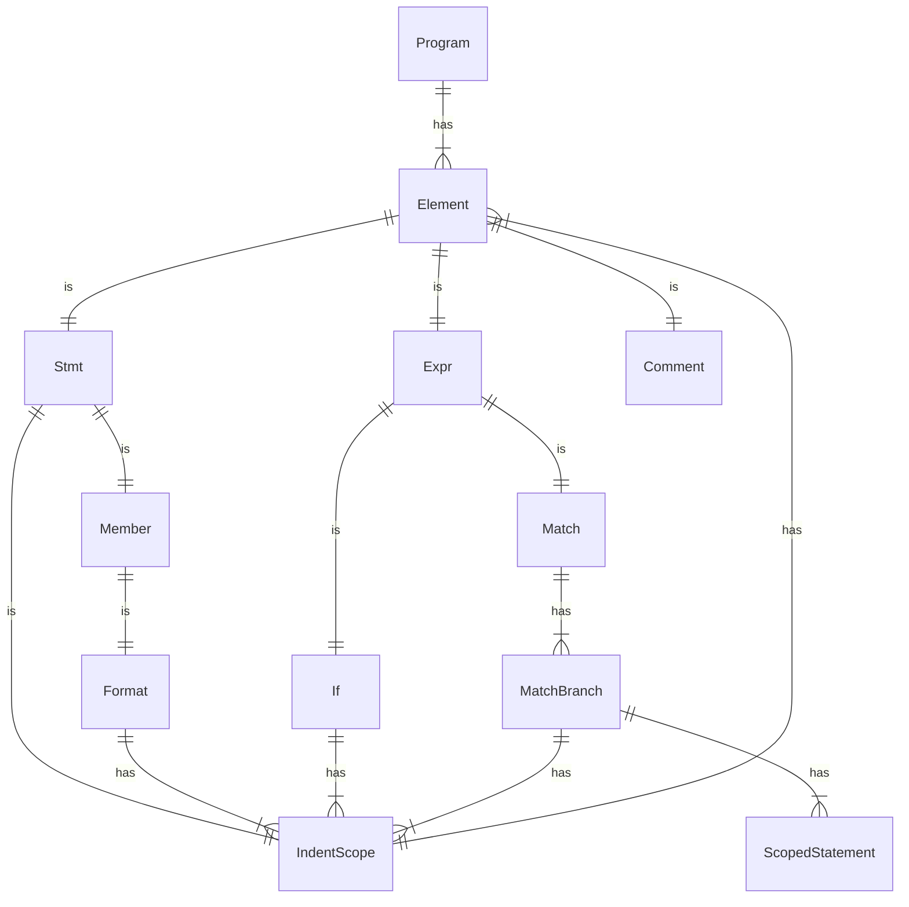

# AST

brgen の AST を記述する
TODO(on-keyday): 自動生成する?

```mermaid
erDiagram

Program ||--|{ Element : has

Element ||--|| Stmt : is
Element ||--|| Expr : is
Element ||--|| Comment : is

Stmt ||--|| IndentScope : is
IndentScope ||--|{ Element : has

Stmt ||--|| Member : is

Member ||--|| Format :is
Format ||--|{ IndentScope : has

Expr ||--|| If : is
Expr ||--|| Match : is
If ||--|{ IndentScope : has
Match ||--|{ MatchBranch : has

MatchBranch ||--|{ IndentScope : has
MatchBranch ||--|{ ScopedStatement : has

```


