# AST
###### generated by script/make_ast_doc.sh
###### timestamp: 2024-02-29-06:24:01 UTC

brgen(lang) の AST

基本の継承関係

```
Node
|        |      |
Expr     Stmt   Type
|        |
Literal  Member
```

継承関係のみ(zoom 可)

```mermaid
flowchart LR
Node -->|derive|Expr
Node -->|derive|Stmt
Node -->|derive|Type
Expr -->|derive|Literal
Stmt -->|derive|Member
Member -->|derive|BuiltinMember
Node -->|derive|Program
Node -->|derive|Comment
Node -->|derive|CommentGroup
Node -->|derive|FieldArgument
Expr -->|derive|Binary
Expr -->|derive|Unary
Expr -->|derive|Cond
Expr -->|derive|Ident
Expr -->|derive|Call
Expr -->|derive|If
Expr -->|derive|MemberAccess
Expr -->|derive|Paren
Expr -->|derive|Index
Expr -->|derive|Match
Expr -->|derive|Range
Expr -->|derive|TmpVar
Expr -->|derive|Import
Expr -->|derive|Cast
Expr -->|derive|Available
Expr -->|derive|SpecifyOrder
Expr -->|derive|ExplicitError
Expr -->|derive|IoOperation
Expr -->|derive|BadExpr
Stmt -->|derive|Loop
Stmt -->|derive|IndentBlock
Stmt -->|derive|ScopedStatement
Stmt -->|derive|MatchBranch
Stmt -->|derive|UnionCandidate
Stmt -->|derive|Return
Stmt -->|derive|Break
Stmt -->|derive|Continue
Stmt -->|derive|Assert
Stmt -->|derive|ImplicitYield
Stmt -->|derive|Metadata
Type -->|derive|IntType
Type -->|derive|FloatType
Type -->|derive|IdentType
Type -->|derive|IntLiteralType
Type -->|derive|StrLiteralType
Type -->|derive|VoidType
Type -->|derive|BoolType
Type -->|derive|ArrayType
Type -->|derive|FunctionType
Type -->|derive|StructType
Type -->|derive|StructUnionType
Type -->|derive|UnionType
Type -->|derive|RangeType
Type -->|derive|EnumType
Type -->|derive|MetaType
Type -->|derive|OptionalType
Type -->|derive|GenericType
Literal -->|derive|IntLiteral
Literal -->|derive|BoolLiteral
Literal -->|derive|StrLiteral
Literal -->|derive|CharLiteral
Literal -->|derive|TypeLiteral
Literal -->|derive|SpecialLiteral
Member -->|derive|Field
Member -->|derive|Format
Member -->|derive|State
Member -->|derive|Enum
Member -->|derive|EnumMember
Member -->|derive|Function
Member -->|derive|BuiltinFunction
Member -->|derive|BuiltinField
Member -->|derive|BuiltinObject
```


継承関係+保持関係(zoom 可)
TODO(on-keyday): ぐちゃぐちゃすぎるのでどうにかしたい

```mermaid
erDiagram
NodeType {
NodeType program
NodeType comment
NodeType comment_group
NodeType field_argument
NodeType expr
NodeType binary
NodeType unary
NodeType cond
NodeType ident
NodeType call_
NodeType if
NodeType member_access
NodeType paren
NodeType index
NodeType match
NodeType range
NodeType tmp_var
NodeType import
NodeType cast
NodeType available
NodeType specify_order
NodeType explicit_error
NodeType io_operation
NodeType bad_expr
NodeType stmt
NodeType loop
NodeType indent_block
NodeType scoped_statement
NodeType match_branch
NodeType union_candidate
NodeType return
NodeType break
NodeType continue
NodeType assert
NodeType implicit_yield
NodeType metadata
NodeType type
NodeType int_type
NodeType float_type
NodeType ident_type
NodeType int_literal_type
NodeType str_literal_type
NodeType void_type
NodeType bool_type
NodeType array_type
NodeType function_type
NodeType struct_type
NodeType struct_union_type
NodeType union_type
NodeType range_type
NodeType enum_type
NodeType meta_type
NodeType optional_type
NodeType generic_type
NodeType literal
NodeType int_literal
NodeType bool_literal
NodeType str_literal
NodeType char_literal
NodeType type_literal
NodeType special_literal
NodeType member
NodeType field
NodeType format
NodeType state
NodeType enum
NodeType enum_member
NodeType function
NodeType builtin_member
NodeType builtin_function
NodeType builtin_field
NodeType builtin_object
}
TokenTag {
TokenTag indent
TokenTag space
TokenTag line
TokenTag punct
TokenTag int_literal
TokenTag bool_literal
TokenTag str_literal
TokenTag char_literal
TokenTag keyword
TokenTag ident
TokenTag comment
TokenTag error
TokenTag unknown
}
UnaryOp {
UnaryOp not
UnaryOp minus_sign
}
BinaryOp {
BinaryOp mul
BinaryOp div
BinaryOp mod
BinaryOp left_arithmetic_shift
BinaryOp right_arithmetic_shift
BinaryOp left_logical_shift
BinaryOp right_logical_shift
BinaryOp bit_and
BinaryOp add
BinaryOp sub
BinaryOp bit_or
BinaryOp bit_xor
BinaryOp equal
BinaryOp not_equal
BinaryOp less
BinaryOp less_or_eq
BinaryOp grater
BinaryOp grater_or_eq
BinaryOp logical_and
BinaryOp logical_or
BinaryOp cond_op_1
BinaryOp cond_op_2
BinaryOp range_exclusive
BinaryOp range_inclusive
BinaryOp assign
BinaryOp define_assign
BinaryOp const_assign
BinaryOp add_assign
BinaryOp sub_assign
BinaryOp mul_assign
BinaryOp div_assign
BinaryOp mod_assign
BinaryOp left_shift_assign
BinaryOp right_shift_assign
BinaryOp bit_and_assign
BinaryOp bit_or_assign
BinaryOp bit_xor_assign
BinaryOp comma
}
IdentUsage {
IdentUsage unknown
IdentUsage reference
IdentUsage define_variable
IdentUsage define_const
IdentUsage define_field
IdentUsage define_format
IdentUsage define_state
IdentUsage define_enum
IdentUsage define_enum_member
IdentUsage define_fn
IdentUsage define_cast_fn
IdentUsage define_arg
IdentUsage reference_type
IdentUsage reference_member
IdentUsage reference_member_type
IdentUsage maybe_type
IdentUsage reference_builtin_fn
}
Endian {
Endian unspec
Endian big
Endian little
}
ConstantLevel {
ConstantLevel unknown
ConstantLevel constant
ConstantLevel immutable_variable
ConstantLevel variable
}
BitAlignment {
BitAlignment byte_aligned
BitAlignment bit_1
BitAlignment bit_2
BitAlignment bit_3
BitAlignment bit_4
BitAlignment bit_5
BitAlignment bit_6
BitAlignment bit_7
BitAlignment not_target
BitAlignment not_decidable
}
Follow {
Follow unknown
Follow end_
Follow fixed
Follow constant
Follow normal
}
IoMethod {
IoMethod unspec
IoMethod output_put
IoMethod input_peek
IoMethod input_get
IoMethod input_backward
IoMethod input_offset
IoMethod input_bit_offset
IoMethod input_remain
IoMethod input_subrange
IoMethod config_endian_little
IoMethod config_endian_big
IoMethod config_endian_native
IoMethod config_bit_order_lsb
IoMethod config_bit_order_msb
}
SpecialLiteralKind {
SpecialLiteralKind input
SpecialLiteralKind output
SpecialLiteralKind config
}
OrderType {
OrderType byte
OrderType bit_stream
OrderType bit_mapping
OrderType bit_both
}
Node {
Loc loc
}
Node |o--|| Loc : strong
Expr {
Type expr_type
ConstantLevel constant_level
}
Node |o--|| Expr : derive
Expr |o--|| Type : strong
Expr |o--|| ConstantLevel : strong
Stmt {
}
Node |o--|| Stmt : derive
Type {
boolean is_explicit
boolean non_dynamic_allocation
BitAlignment bit_alignment
number bit_size
}
Node |o--|| Type : derive
Type |o--|| boolean : strong
Type |o--|| boolean : strong
Type |o--|| BitAlignment : strong
Type |o--|| number : strong
Literal {
}
Expr |o--|| Literal : derive
Member {
Member belong
StructType belong_struct
Ident ident
}
Stmt |o--|| Member : derive
Member |o--|| Member : weak
Member |o--|| StructType : weak
Member |o--|| Ident : strong
BuiltinMember {
}
Member |o--|| BuiltinMember : derive
Node |o--|| Program : derive
Program {
StructType struct_type
Node[] elements
Scope global_scope
}
Program |o--||StructType : strong
Program |o--||Node : strong
Program |o--||Scope : strong
Node |o--|| Comment : derive
Comment {
string comment
}
Comment |o--||string : strong
Node |o--|| CommentGroup : derive
CommentGroup {
Comment[] comments
}
CommentGroup |o--||Comment : strong
Node |o--|| FieldArgument : derive
FieldArgument {
Expr raw_arguments
Loc end_loc
Expr[] collected_arguments
Expr[] arguments
Expr alignment
number alignment_value
Expr sub_byte_length
Expr sub_byte_begin
Expr peek
number peek_value
TypeLiteral type_map
Metadata[] metadata
}
FieldArgument |o--||Expr : strong
FieldArgument |o--||Loc : strong
FieldArgument |o--||Expr : weak
FieldArgument |o--||Expr : strong
FieldArgument |o--||Expr : strong
FieldArgument |o--||number : strong
FieldArgument |o--||Expr : strong
FieldArgument |o--||Expr : strong
FieldArgument |o--||Expr : strong
FieldArgument |o--||number : strong
FieldArgument |o--||TypeLiteral : strong
FieldArgument |o--||Metadata : strong
Expr |o--|| Binary : derive
Binary {
BinaryOp op
Expr left
Expr right
}
Binary |o--||BinaryOp : strong
Binary |o--||Expr : strong
Binary |o--||Expr : strong
Expr |o--|| Unary : derive
Unary {
UnaryOp op
Expr expr
}
Unary |o--||UnaryOp : strong
Unary |o--||Expr : strong
Expr |o--|| Cond : derive
Cond {
Expr cond
Expr then
Loc els_loc
Expr els
}
Cond |o--||Expr : strong
Cond |o--||Expr : strong
Cond |o--||Loc : strong
Cond |o--||Expr : strong
Expr |o--|| Ident : derive
Ident {
string ident
IdentUsage usage
Node base
Scope scope
}
Ident |o--||string : strong
Ident |o--||IdentUsage : strong
Ident |o--||Node : weak
Ident |o--||Scope : strong
Expr |o--|| Call : derive
Call {
Expr callee
Expr raw_arguments
Expr[] arguments
Loc end_loc
}
Call |o--||Expr : strong
Call |o--||Expr : strong
Call |o--||Expr : strong
Call |o--||Loc : strong
Expr |o--|| If : derive
If {
StructUnionType struct_union_type
Scope cond_scope
Expr cond
IndentBlock then
Node els
}
If |o--||StructUnionType : strong
If |o--||Scope : strong
If |o--||Expr : strong
If |o--||IndentBlock : strong
If |o--||Node : strong
Expr |o--|| MemberAccess : derive
MemberAccess {
Expr target
Ident member
Ident base
}
MemberAccess |o--||Expr : strong
MemberAccess |o--||Ident : strong
MemberAccess |o--||Ident : weak
Expr |o--|| Paren : derive
Paren {
Expr expr
Loc end_loc
}
Paren |o--||Expr : strong
Paren |o--||Loc : strong
Expr |o--|| Index : derive
Index {
Expr expr
Expr index
Loc end_loc
}
Index |o--||Expr : strong
Index |o--||Expr : strong
Index |o--||Loc : strong
Expr |o--|| Match : derive
Match {
StructUnionType struct_union_type
Scope cond_scope
Expr cond
MatchBranch[] branch
}
Match |o--||StructUnionType : strong
Match |o--||Scope : strong
Match |o--||Expr : strong
Match |o--||MatchBranch : strong
Expr |o--|| Range : derive
Range {
BinaryOp op
Expr start
Expr end
}
Range |o--||BinaryOp : strong
Range |o--||Expr : strong
Range |o--||Expr : strong
Expr |o--|| TmpVar : derive
TmpVar {
number tmp_var
}
TmpVar |o--||number : strong
Expr |o--|| Import : derive
Import {
string path
Call base
Program import_desc
}
Import |o--||string : strong
Import |o--||Call : strong
Import |o--||Program : strong
Expr |o--|| Cast : derive
Cast {
Call base
Expr expr
}
Cast |o--||Call : strong
Cast |o--||Expr : strong
Expr |o--|| Available : derive
Available {
Call base
Expr target
}
Available |o--||Call : strong
Available |o--||Expr : strong
Expr |o--|| SpecifyOrder : derive
SpecifyOrder {
Binary base
OrderType order_type
Expr order
number order_value
}
SpecifyOrder |o--||Binary : strong
SpecifyOrder |o--||OrderType : strong
SpecifyOrder |o--||Expr : strong
SpecifyOrder |o--||number : strong
Expr |o--|| ExplicitError : derive
ExplicitError {
Call base
StrLiteral message
}
ExplicitError |o--||Call : strong
ExplicitError |o--||StrLiteral : strong
Expr |o--|| IoOperation : derive
IoOperation {
Expr base
IoMethod method
Expr[] arguments
}
IoOperation |o--||Expr : strong
IoOperation |o--||IoMethod : strong
IoOperation |o--||Expr : strong
Expr |o--|| BadExpr : derive
BadExpr {
string content
}
BadExpr |o--||string : strong
Stmt |o--|| Loop : derive
Loop {
Scope cond_scope
Expr init
Expr cond
Expr step
IndentBlock body
}
Loop |o--||Scope : strong
Loop |o--||Expr : strong
Loop |o--||Expr : strong
Loop |o--||Expr : strong
Loop |o--||IndentBlock : strong
Stmt |o--|| IndentBlock : derive
IndentBlock {
StructType struct_type
Node[] elements
Scope scope
}
IndentBlock |o--||StructType : strong
IndentBlock |o--||Node : strong
IndentBlock |o--||Scope : strong
Stmt |o--|| ScopedStatement : derive
ScopedStatement {
StructType struct_type
Node statement
Scope scope
}
ScopedStatement |o--||StructType : strong
ScopedStatement |o--||Node : strong
ScopedStatement |o--||Scope : strong
Stmt |o--|| MatchBranch : derive
MatchBranch {
Match belong
Expr cond
Loc sym_loc
Node then
}
MatchBranch |o--||Match : weak
MatchBranch |o--||Expr : strong
MatchBranch |o--||Loc : strong
MatchBranch |o--||Node : strong
Stmt |o--|| UnionCandidate : derive
UnionCandidate {
Expr cond
Field field
}
UnionCandidate |o--||Expr : weak
UnionCandidate |o--||Field : weak
Stmt |o--|| Return : derive
Return {
Expr expr
}
Return |o--||Expr : strong
Stmt |o--|| Break : derive
Break {
}
Stmt |o--|| Continue : derive
Continue {
}
Stmt |o--|| Assert : derive
Assert {
Binary cond
boolean is_io_related
}
Assert |o--||Binary : strong
Assert |o--||boolean : strong
Stmt |o--|| ImplicitYield : derive
ImplicitYield {
Expr expr
}
ImplicitYield |o--||Expr : strong
Stmt |o--|| Metadata : derive
Metadata {
Expr base
string name
Expr[] values
}
Metadata |o--||Expr : strong
Metadata |o--||string : strong
Metadata |o--||Expr : strong
Type |o--|| IntType : derive
IntType {
Endian endian
boolean is_signed
boolean is_common_supported
}
IntType |o--||Endian : strong
IntType |o--||boolean : strong
IntType |o--||boolean : strong
Type |o--|| FloatType : derive
FloatType {
Endian endian
boolean is_common_supported
}
FloatType |o--||Endian : strong
FloatType |o--||boolean : strong
Type |o--|| IdentType : derive
IdentType {
MemberAccess import_ref
Ident ident
Type base
}
IdentType |o--||MemberAccess : strong
IdentType |o--||Ident : strong
IdentType |o--||Type : weak
Type |o--|| IntLiteralType : derive
IntLiteralType {
IntLiteral base
}
IntLiteralType |o--||IntLiteral : weak
Type |o--|| StrLiteralType : derive
StrLiteralType {
StrLiteral base
StrLiteral strong_ref
}
StrLiteralType |o--||StrLiteral : weak
StrLiteralType |o--||StrLiteral : strong
Type |o--|| VoidType : derive
VoidType {
}
Type |o--|| BoolType : derive
BoolType {
}
Type |o--|| ArrayType : derive
ArrayType {
Loc end_loc
Type element_type
Expr length
number length_value
}
ArrayType |o--||Loc : strong
ArrayType |o--||Type : strong
ArrayType |o--||Expr : strong
ArrayType |o--||number : strong
Type |o--|| FunctionType : derive
FunctionType {
Type return_type
Type[] parameters
}
FunctionType |o--||Type : strong
FunctionType |o--||Type : strong
Type |o--|| StructType : derive
StructType {
Member[] fields
Node base
boolean recursive
number fixed_header_size
number fixed_tail_size
}
StructType |o--||Member : strong
StructType |o--||Node : weak
StructType |o--||boolean : strong
StructType |o--||number : strong
StructType |o--||number : strong
Type |o--|| StructUnionType : derive
StructUnionType {
Expr cond
Expr[] conds
StructType[] structs
Expr base
Field[] union_fields
boolean exhaustive
}
StructUnionType |o--||Expr : strong
StructUnionType |o--||Expr : strong
StructUnionType |o--||StructType : strong
StructUnionType |o--||Expr : weak
StructUnionType |o--||Field : weak
StructUnionType |o--||boolean : strong
Type |o--|| UnionType : derive
UnionType {
Expr cond
UnionCandidate[] candidates
StructUnionType base_type
Type common_type
}
UnionType |o--||Expr : weak
UnionType |o--||UnionCandidate : strong
UnionType |o--||StructUnionType : weak
UnionType |o--||Type : strong
Type |o--|| RangeType : derive
RangeType {
Type base_type
Range range
}
RangeType |o--||Type : strong
RangeType |o--||Range : weak
Type |o--|| EnumType : derive
EnumType {
Enum base
}
EnumType |o--||Enum : weak
Type |o--|| MetaType : derive
MetaType {
}
Type |o--|| OptionalType : derive
OptionalType {
Type base_type
}
OptionalType |o--||Type : strong
Type |o--|| GenericType : derive
GenericType {
Member belong
}
GenericType |o--||Member : weak
Literal |o--|| IntLiteral : derive
IntLiteral {
string value
}
IntLiteral |o--||string : strong
Literal |o--|| BoolLiteral : derive
BoolLiteral {
boolean value
}
BoolLiteral |o--||boolean : strong
Literal |o--|| StrLiteral : derive
StrLiteral {
string value
number length
}
StrLiteral |o--||string : strong
StrLiteral |o--||number : strong
Literal |o--|| CharLiteral : derive
CharLiteral {
string value
number code
}
CharLiteral |o--||string : strong
CharLiteral |o--||number : strong
Literal |o--|| TypeLiteral : derive
TypeLiteral {
Type type_literal
Loc end_loc
}
TypeLiteral |o--||Type : strong
TypeLiteral |o--||Loc : strong
Literal |o--|| SpecialLiteral : derive
SpecialLiteral {
SpecialLiteralKind kind
}
SpecialLiteral |o--||SpecialLiteralKind : strong
Member |o--|| Field : derive
Field {
Loc colon_loc
boolean is_state_variable
Type field_type
FieldArgument arguments
number offset_bit
number offset_recent
number tail_offset_bit
number tail_offset_recent
BitAlignment bit_alignment
BitAlignment eventual_bit_alignment
Follow follow
Follow eventual_follow
Field next
}
Field |o--||Loc : strong
Field |o--||boolean : strong
Field |o--||Type : strong
Field |o--||FieldArgument : strong
Field |o--||number : strong
Field |o--||number : strong
Field |o--||number : strong
Field |o--||number : strong
Field |o--||BitAlignment : strong
Field |o--||BitAlignment : strong
Field |o--||Follow : strong
Field |o--||Follow : strong
Field |o--||Field : weak
Member |o--|| Format : derive
Format {
IndentBlock body
Function encode_fn
Function decode_fn
Function[] cast_fns
IdentType[] depends
Field[] state_variables
}
Format |o--||IndentBlock : strong
Format |o--||Function : weak
Format |o--||Function : weak
Format |o--||Function : weak
Format |o--||IdentType : weak
Format |o--||Field : weak
Member |o--|| State : derive
State {
IndentBlock body
}
State |o--||IndentBlock : strong
Member |o--|| Enum : derive
Enum {
Scope scope
Loc colon_loc
Type base_type
EnumMember[] members
EnumType enum_type
}
Enum |o--||Scope : strong
Enum |o--||Loc : strong
Enum |o--||Type : strong
Enum |o--||EnumMember : strong
Enum |o--||EnumType : strong
Member |o--|| EnumMember : derive
EnumMember {
Expr raw_expr
Expr value
StrLiteral str_literal
}
EnumMember |o--||Expr : strong
EnumMember |o--||Expr : strong
EnumMember |o--||StrLiteral : strong
Member |o--|| Function : derive
Function {
Field[] parameters
Type return_type
IndentBlock body
FunctionType func_type
boolean is_cast
Loc cast_loc
}
Function |o--||Field : strong
Function |o--||Type : strong
Function |o--||IndentBlock : strong
Function |o--||FunctionType : strong
Function |o--||boolean : strong
Function |o--||Loc : strong
Member |o--|| BuiltinFunction : derive
BuiltinFunction {
FunctionType func_type
}
BuiltinFunction |o--||FunctionType : strong
Member |o--|| BuiltinField : derive
BuiltinField {
Type field_type
}
BuiltinField |o--||Type : strong
Member |o--|| BuiltinObject : derive
BuiltinObject {
BuiltinMember[] members
}
BuiltinObject |o--||BuiltinMember : strong
Scope {
Scope prev
Scope next
Scope branch
Ident[] ident
Node owner
boolean branch_root
}
Scope |o--||Scope : weak
Scope |o--||Scope : strong
Scope |o--||Scope : strong
Scope |o--||Ident : weak
Scope |o--||Node : weak
Scope |o--||boolean : strong
Pos {
number begin
number end
}
Pos |o--||number : strong
Pos |o--||number : strong
Loc {
Pos pos
number file
number line
number col
}
Loc |o--||Pos : strong
Loc |o--||number : strong
Loc |o--||number : strong
Loc |o--||number : strong
Token {
TokenTag tag
string token
Loc loc
}
Token |o--||TokenTag : strong
Token |o--||string : strong
Token |o--||Loc : strong
RawScope {
number prev
number next
number branch
number[] ident
number owner
boolean branch_root
}
RawScope |o--||number : strong
RawScope |o--||number : strong
RawScope |o--||number : strong
RawScope |o--||number : strong
RawScope |o--||number : strong
RawScope |o--||boolean : strong
RawNode {
NodeType node_type
Loc loc
any body
}
RawNode |o--||NodeType : strong
RawNode |o--||Loc : strong
RawNode |o--||any : strong
SrcErrorEntry {
string msg
string file
Loc loc
string src
boolean warn
}
SrcErrorEntry |o--||string : strong
SrcErrorEntry |o--||string : strong
SrcErrorEntry |o--||Loc : strong
SrcErrorEntry |o--||string : strong
SrcErrorEntry |o--||boolean : strong
SrcError {
SrcErrorEntry[] errs
}
SrcError |o--||SrcErrorEntry : strong
JsonAst {
RawNode[] node
RawScope[] scope
}
JsonAst |o--||RawNode : strong
JsonAst |o--||RawScope : strong
AstFile {
string[] files
JsonAst ast
SrcError error
}
AstFile |o--||string : strong
AstFile |o--||JsonAst : strong
AstFile |o--||SrcError : strong
TokenFile {
string[] files
Token[] tokens
SrcError error
}
TokenFile |o--||string : strong
TokenFile |o--||Token : strong
TokenFile |o--||SrcError : strong
```

元ソース

```
erDiagram
NodeType {
NodeType program
NodeType comment
NodeType comment_group
NodeType field_argument
NodeType expr
NodeType binary
NodeType unary
NodeType cond
NodeType ident
NodeType call_
NodeType if
NodeType member_access
NodeType paren
NodeType index
NodeType match
NodeType range
NodeType tmp_var
NodeType import
NodeType cast
NodeType available
NodeType specify_order
NodeType explicit_error
NodeType io_operation
NodeType bad_expr
NodeType stmt
NodeType loop
NodeType indent_block
NodeType scoped_statement
NodeType match_branch
NodeType union_candidate
NodeType return
NodeType break
NodeType continue
NodeType assert
NodeType implicit_yield
NodeType metadata
NodeType type
NodeType int_type
NodeType float_type
NodeType ident_type
NodeType int_literal_type
NodeType str_literal_type
NodeType void_type
NodeType bool_type
NodeType array_type
NodeType function_type
NodeType struct_type
NodeType struct_union_type
NodeType union_type
NodeType range_type
NodeType enum_type
NodeType meta_type
NodeType optional_type
NodeType generic_type
NodeType literal
NodeType int_literal
NodeType bool_literal
NodeType str_literal
NodeType char_literal
NodeType type_literal
NodeType special_literal
NodeType member
NodeType field
NodeType format
NodeType state
NodeType enum
NodeType enum_member
NodeType function
NodeType builtin_member
NodeType builtin_function
NodeType builtin_field
NodeType builtin_object
}
TokenTag {
TokenTag indent
TokenTag space
TokenTag line
TokenTag punct
TokenTag int_literal
TokenTag bool_literal
TokenTag str_literal
TokenTag char_literal
TokenTag keyword
TokenTag ident
TokenTag comment
TokenTag error
TokenTag unknown
}
UnaryOp {
UnaryOp not
UnaryOp minus_sign
}
BinaryOp {
BinaryOp mul
BinaryOp div
BinaryOp mod
BinaryOp left_arithmetic_shift
BinaryOp right_arithmetic_shift
BinaryOp left_logical_shift
BinaryOp right_logical_shift
BinaryOp bit_and
BinaryOp add
BinaryOp sub
BinaryOp bit_or
BinaryOp bit_xor
BinaryOp equal
BinaryOp not_equal
BinaryOp less
BinaryOp less_or_eq
BinaryOp grater
BinaryOp grater_or_eq
BinaryOp logical_and
BinaryOp logical_or
BinaryOp cond_op_1
BinaryOp cond_op_2
BinaryOp range_exclusive
BinaryOp range_inclusive
BinaryOp assign
BinaryOp define_assign
BinaryOp const_assign
BinaryOp add_assign
BinaryOp sub_assign
BinaryOp mul_assign
BinaryOp div_assign
BinaryOp mod_assign
BinaryOp left_shift_assign
BinaryOp right_shift_assign
BinaryOp bit_and_assign
BinaryOp bit_or_assign
BinaryOp bit_xor_assign
BinaryOp comma
}
IdentUsage {
IdentUsage unknown
IdentUsage reference
IdentUsage define_variable
IdentUsage define_const
IdentUsage define_field
IdentUsage define_format
IdentUsage define_state
IdentUsage define_enum
IdentUsage define_enum_member
IdentUsage define_fn
IdentUsage define_cast_fn
IdentUsage define_arg
IdentUsage reference_type
IdentUsage reference_member
IdentUsage reference_member_type
IdentUsage maybe_type
IdentUsage reference_builtin_fn
}
Endian {
Endian unspec
Endian big
Endian little
}
ConstantLevel {
ConstantLevel unknown
ConstantLevel constant
ConstantLevel immutable_variable
ConstantLevel variable
}
BitAlignment {
BitAlignment byte_aligned
BitAlignment bit_1
BitAlignment bit_2
BitAlignment bit_3
BitAlignment bit_4
BitAlignment bit_5
BitAlignment bit_6
BitAlignment bit_7
BitAlignment not_target
BitAlignment not_decidable
}
Follow {
Follow unknown
Follow end_
Follow fixed
Follow constant
Follow normal
}
IoMethod {
IoMethod unspec
IoMethod output_put
IoMethod input_peek
IoMethod input_get
IoMethod input_backward
IoMethod input_offset
IoMethod input_bit_offset
IoMethod input_remain
IoMethod input_subrange
IoMethod config_endian_little
IoMethod config_endian_big
IoMethod config_endian_native
IoMethod config_bit_order_lsb
IoMethod config_bit_order_msb
}
SpecialLiteralKind {
SpecialLiteralKind input
SpecialLiteralKind output
SpecialLiteralKind config
}
OrderType {
OrderType byte
OrderType bit_stream
OrderType bit_mapping
OrderType bit_both
}
Node {
Loc loc
}
Node |o--|| Loc : strong
Expr {
Type expr_type
ConstantLevel constant_level
}
Node |o--|| Expr : derive
Expr |o--|| Type : strong
Expr |o--|| ConstantLevel : strong
Stmt {
}
Node |o--|| Stmt : derive
Type {
boolean is_explicit
boolean non_dynamic_allocation
BitAlignment bit_alignment
number bit_size
}
Node |o--|| Type : derive
Type |o--|| boolean : strong
Type |o--|| boolean : strong
Type |o--|| BitAlignment : strong
Type |o--|| number : strong
Literal {
}
Expr |o--|| Literal : derive
Member {
Member belong
StructType belong_struct
Ident ident
}
Stmt |o--|| Member : derive
Member |o--|| Member : weak
Member |o--|| StructType : weak
Member |o--|| Ident : strong
BuiltinMember {
}
Member |o--|| BuiltinMember : derive
Node |o--|| Program : derive
Program {
StructType struct_type
Node[] elements
Scope global_scope
}
Program |o--||StructType : strong
Program |o--||Node : strong
Program |o--||Scope : strong
Node |o--|| Comment : derive
Comment {
string comment
}
Comment |o--||string : strong
Node |o--|| CommentGroup : derive
CommentGroup {
Comment[] comments
}
CommentGroup |o--||Comment : strong
Node |o--|| FieldArgument : derive
FieldArgument {
Expr raw_arguments
Loc end_loc
Expr[] collected_arguments
Expr[] arguments
Expr alignment
number alignment_value
Expr sub_byte_length
Expr sub_byte_begin
Expr peek
number peek_value
TypeLiteral type_map
Metadata[] metadata
}
FieldArgument |o--||Expr : strong
FieldArgument |o--||Loc : strong
FieldArgument |o--||Expr : weak
FieldArgument |o--||Expr : strong
FieldArgument |o--||Expr : strong
FieldArgument |o--||number : strong
FieldArgument |o--||Expr : strong
FieldArgument |o--||Expr : strong
FieldArgument |o--||Expr : strong
FieldArgument |o--||number : strong
FieldArgument |o--||TypeLiteral : strong
FieldArgument |o--||Metadata : strong
Expr |o--|| Binary : derive
Binary {
BinaryOp op
Expr left
Expr right
}
Binary |o--||BinaryOp : strong
Binary |o--||Expr : strong
Binary |o--||Expr : strong
Expr |o--|| Unary : derive
Unary {
UnaryOp op
Expr expr
}
Unary |o--||UnaryOp : strong
Unary |o--||Expr : strong
Expr |o--|| Cond : derive
Cond {
Expr cond
Expr then
Loc els_loc
Expr els
}
Cond |o--||Expr : strong
Cond |o--||Expr : strong
Cond |o--||Loc : strong
Cond |o--||Expr : strong
Expr |o--|| Ident : derive
Ident {
string ident
IdentUsage usage
Node base
Scope scope
}
Ident |o--||string : strong
Ident |o--||IdentUsage : strong
Ident |o--||Node : weak
Ident |o--||Scope : strong
Expr |o--|| Call : derive
Call {
Expr callee
Expr raw_arguments
Expr[] arguments
Loc end_loc
}
Call |o--||Expr : strong
Call |o--||Expr : strong
Call |o--||Expr : strong
Call |o--||Loc : strong
Expr |o--|| If : derive
If {
StructUnionType struct_union_type
Scope cond_scope
Expr cond
IndentBlock then
Node els
}
If |o--||StructUnionType : strong
If |o--||Scope : strong
If |o--||Expr : strong
If |o--||IndentBlock : strong
If |o--||Node : strong
Expr |o--|| MemberAccess : derive
MemberAccess {
Expr target
Ident member
Ident base
}
MemberAccess |o--||Expr : strong
MemberAccess |o--||Ident : strong
MemberAccess |o--||Ident : weak
Expr |o--|| Paren : derive
Paren {
Expr expr
Loc end_loc
}
Paren |o--||Expr : strong
Paren |o--||Loc : strong
Expr |o--|| Index : derive
Index {
Expr expr
Expr index
Loc end_loc
}
Index |o--||Expr : strong
Index |o--||Expr : strong
Index |o--||Loc : strong
Expr |o--|| Match : derive
Match {
StructUnionType struct_union_type
Scope cond_scope
Expr cond
MatchBranch[] branch
}
Match |o--||StructUnionType : strong
Match |o--||Scope : strong
Match |o--||Expr : strong
Match |o--||MatchBranch : strong
Expr |o--|| Range : derive
Range {
BinaryOp op
Expr start
Expr end
}
Range |o--||BinaryOp : strong
Range |o--||Expr : strong
Range |o--||Expr : strong
Expr |o--|| TmpVar : derive
TmpVar {
number tmp_var
}
TmpVar |o--||number : strong
Expr |o--|| Import : derive
Import {
string path
Call base
Program import_desc
}
Import |o--||string : strong
Import |o--||Call : strong
Import |o--||Program : strong
Expr |o--|| Cast : derive
Cast {
Call base
Expr expr
}
Cast |o--||Call : strong
Cast |o--||Expr : strong
Expr |o--|| Available : derive
Available {
Call base
Expr target
}
Available |o--||Call : strong
Available |o--||Expr : strong
Expr |o--|| SpecifyOrder : derive
SpecifyOrder {
Binary base
OrderType order_type
Expr order
number order_value
}
SpecifyOrder |o--||Binary : strong
SpecifyOrder |o--||OrderType : strong
SpecifyOrder |o--||Expr : strong
SpecifyOrder |o--||number : strong
Expr |o--|| ExplicitError : derive
ExplicitError {
Call base
StrLiteral message
}
ExplicitError |o--||Call : strong
ExplicitError |o--||StrLiteral : strong
Expr |o--|| IoOperation : derive
IoOperation {
Expr base
IoMethod method
Expr[] arguments
}
IoOperation |o--||Expr : strong
IoOperation |o--||IoMethod : strong
IoOperation |o--||Expr : strong
Expr |o--|| BadExpr : derive
BadExpr {
string content
}
BadExpr |o--||string : strong
Stmt |o--|| Loop : derive
Loop {
Scope cond_scope
Expr init
Expr cond
Expr step
IndentBlock body
}
Loop |o--||Scope : strong
Loop |o--||Expr : strong
Loop |o--||Expr : strong
Loop |o--||Expr : strong
Loop |o--||IndentBlock : strong
Stmt |o--|| IndentBlock : derive
IndentBlock {
StructType struct_type
Node[] elements
Scope scope
}
IndentBlock |o--||StructType : strong
IndentBlock |o--||Node : strong
IndentBlock |o--||Scope : strong
Stmt |o--|| ScopedStatement : derive
ScopedStatement {
StructType struct_type
Node statement
Scope scope
}
ScopedStatement |o--||StructType : strong
ScopedStatement |o--||Node : strong
ScopedStatement |o--||Scope : strong
Stmt |o--|| MatchBranch : derive
MatchBranch {
Match belong
Expr cond
Loc sym_loc
Node then
}
MatchBranch |o--||Match : weak
MatchBranch |o--||Expr : strong
MatchBranch |o--||Loc : strong
MatchBranch |o--||Node : strong
Stmt |o--|| UnionCandidate : derive
UnionCandidate {
Expr cond
Field field
}
UnionCandidate |o--||Expr : weak
UnionCandidate |o--||Field : weak
Stmt |o--|| Return : derive
Return {
Expr expr
}
Return |o--||Expr : strong
Stmt |o--|| Break : derive
Break {
}
Stmt |o--|| Continue : derive
Continue {
}
Stmt |o--|| Assert : derive
Assert {
Binary cond
boolean is_io_related
}
Assert |o--||Binary : strong
Assert |o--||boolean : strong
Stmt |o--|| ImplicitYield : derive
ImplicitYield {
Expr expr
}
ImplicitYield |o--||Expr : strong
Stmt |o--|| Metadata : derive
Metadata {
Expr base
string name
Expr[] values
}
Metadata |o--||Expr : strong
Metadata |o--||string : strong
Metadata |o--||Expr : strong
Type |o--|| IntType : derive
IntType {
Endian endian
boolean is_signed
boolean is_common_supported
}
IntType |o--||Endian : strong
IntType |o--||boolean : strong
IntType |o--||boolean : strong
Type |o--|| FloatType : derive
FloatType {
Endian endian
boolean is_common_supported
}
FloatType |o--||Endian : strong
FloatType |o--||boolean : strong
Type |o--|| IdentType : derive
IdentType {
MemberAccess import_ref
Ident ident
Type base
}
IdentType |o--||MemberAccess : strong
IdentType |o--||Ident : strong
IdentType |o--||Type : weak
Type |o--|| IntLiteralType : derive
IntLiteralType {
IntLiteral base
}
IntLiteralType |o--||IntLiteral : weak
Type |o--|| StrLiteralType : derive
StrLiteralType {
StrLiteral base
StrLiteral strong_ref
}
StrLiteralType |o--||StrLiteral : weak
StrLiteralType |o--||StrLiteral : strong
Type |o--|| VoidType : derive
VoidType {
}
Type |o--|| BoolType : derive
BoolType {
}
Type |o--|| ArrayType : derive
ArrayType {
Loc end_loc
Type element_type
Expr length
number length_value
}
ArrayType |o--||Loc : strong
ArrayType |o--||Type : strong
ArrayType |o--||Expr : strong
ArrayType |o--||number : strong
Type |o--|| FunctionType : derive
FunctionType {
Type return_type
Type[] parameters
}
FunctionType |o--||Type : strong
FunctionType |o--||Type : strong
Type |o--|| StructType : derive
StructType {
Member[] fields
Node base
boolean recursive
number fixed_header_size
number fixed_tail_size
}
StructType |o--||Member : strong
StructType |o--||Node : weak
StructType |o--||boolean : strong
StructType |o--||number : strong
StructType |o--||number : strong
Type |o--|| StructUnionType : derive
StructUnionType {
Expr cond
Expr[] conds
StructType[] structs
Expr base
Field[] union_fields
boolean exhaustive
}
StructUnionType |o--||Expr : strong
StructUnionType |o--||Expr : strong
StructUnionType |o--||StructType : strong
StructUnionType |o--||Expr : weak
StructUnionType |o--||Field : weak
StructUnionType |o--||boolean : strong
Type |o--|| UnionType : derive
UnionType {
Expr cond
UnionCandidate[] candidates
StructUnionType base_type
Type common_type
}
UnionType |o--||Expr : weak
UnionType |o--||UnionCandidate : strong
UnionType |o--||StructUnionType : weak
UnionType |o--||Type : strong
Type |o--|| RangeType : derive
RangeType {
Type base_type
Range range
}
RangeType |o--||Type : strong
RangeType |o--||Range : weak
Type |o--|| EnumType : derive
EnumType {
Enum base
}
EnumType |o--||Enum : weak
Type |o--|| MetaType : derive
MetaType {
}
Type |o--|| OptionalType : derive
OptionalType {
Type base_type
}
OptionalType |o--||Type : strong
Type |o--|| GenericType : derive
GenericType {
Member belong
}
GenericType |o--||Member : weak
Literal |o--|| IntLiteral : derive
IntLiteral {
string value
}
IntLiteral |o--||string : strong
Literal |o--|| BoolLiteral : derive
BoolLiteral {
boolean value
}
BoolLiteral |o--||boolean : strong
Literal |o--|| StrLiteral : derive
StrLiteral {
string value
number length
}
StrLiteral |o--||string : strong
StrLiteral |o--||number : strong
Literal |o--|| CharLiteral : derive
CharLiteral {
string value
number code
}
CharLiteral |o--||string : strong
CharLiteral |o--||number : strong
Literal |o--|| TypeLiteral : derive
TypeLiteral {
Type type_literal
Loc end_loc
}
TypeLiteral |o--||Type : strong
TypeLiteral |o--||Loc : strong
Literal |o--|| SpecialLiteral : derive
SpecialLiteral {
SpecialLiteralKind kind
}
SpecialLiteral |o--||SpecialLiteralKind : strong
Member |o--|| Field : derive
Field {
Loc colon_loc
boolean is_state_variable
Type field_type
FieldArgument arguments
number offset_bit
number offset_recent
number tail_offset_bit
number tail_offset_recent
BitAlignment bit_alignment
BitAlignment eventual_bit_alignment
Follow follow
Follow eventual_follow
Field next
}
Field |o--||Loc : strong
Field |o--||boolean : strong
Field |o--||Type : strong
Field |o--||FieldArgument : strong
Field |o--||number : strong
Field |o--||number : strong
Field |o--||number : strong
Field |o--||number : strong
Field |o--||BitAlignment : strong
Field |o--||BitAlignment : strong
Field |o--||Follow : strong
Field |o--||Follow : strong
Field |o--||Field : weak
Member |o--|| Format : derive
Format {
IndentBlock body
Function encode_fn
Function decode_fn
Function[] cast_fns
IdentType[] depends
Field[] state_variables
}
Format |o--||IndentBlock : strong
Format |o--||Function : weak
Format |o--||Function : weak
Format |o--||Function : weak
Format |o--||IdentType : weak
Format |o--||Field : weak
Member |o--|| State : derive
State {
IndentBlock body
}
State |o--||IndentBlock : strong
Member |o--|| Enum : derive
Enum {
Scope scope
Loc colon_loc
Type base_type
EnumMember[] members
EnumType enum_type
}
Enum |o--||Scope : strong
Enum |o--||Loc : strong
Enum |o--||Type : strong
Enum |o--||EnumMember : strong
Enum |o--||EnumType : strong
Member |o--|| EnumMember : derive
EnumMember {
Expr raw_expr
Expr value
StrLiteral str_literal
}
EnumMember |o--||Expr : strong
EnumMember |o--||Expr : strong
EnumMember |o--||StrLiteral : strong
Member |o--|| Function : derive
Function {
Field[] parameters
Type return_type
IndentBlock body
FunctionType func_type
boolean is_cast
Loc cast_loc
}
Function |o--||Field : strong
Function |o--||Type : strong
Function |o--||IndentBlock : strong
Function |o--||FunctionType : strong
Function |o--||boolean : strong
Function |o--||Loc : strong
Member |o--|| BuiltinFunction : derive
BuiltinFunction {
FunctionType func_type
}
BuiltinFunction |o--||FunctionType : strong
Member |o--|| BuiltinField : derive
BuiltinField {
Type field_type
}
BuiltinField |o--||Type : strong
Member |o--|| BuiltinObject : derive
BuiltinObject {
BuiltinMember[] members
}
BuiltinObject |o--||BuiltinMember : strong
Scope {
Scope prev
Scope next
Scope branch
Ident[] ident
Node owner
boolean branch_root
}
Scope |o--||Scope : weak
Scope |o--||Scope : strong
Scope |o--||Scope : strong
Scope |o--||Ident : weak
Scope |o--||Node : weak
Scope |o--||boolean : strong
Pos {
number begin
number end
}
Pos |o--||number : strong
Pos |o--||number : strong
Loc {
Pos pos
number file
number line
number col
}
Loc |o--||Pos : strong
Loc |o--||number : strong
Loc |o--||number : strong
Loc |o--||number : strong
Token {
TokenTag tag
string token
Loc loc
}
Token |o--||TokenTag : strong
Token |o--||string : strong
Token |o--||Loc : strong
RawScope {
number prev
number next
number branch
number[] ident
number owner
boolean branch_root
}
RawScope |o--||number : strong
RawScope |o--||number : strong
RawScope |o--||number : strong
RawScope |o--||number : strong
RawScope |o--||number : strong
RawScope |o--||boolean : strong
RawNode {
NodeType node_type
Loc loc
any body
}
RawNode |o--||NodeType : strong
RawNode |o--||Loc : strong
RawNode |o--||any : strong
SrcErrorEntry {
string msg
string file
Loc loc
string src
boolean warn
}
SrcErrorEntry |o--||string : strong
SrcErrorEntry |o--||string : strong
SrcErrorEntry |o--||Loc : strong
SrcErrorEntry |o--||string : strong
SrcErrorEntry |o--||boolean : strong
SrcError {
SrcErrorEntry[] errs
}
SrcError |o--||SrcErrorEntry : strong
JsonAst {
RawNode[] node
RawScope[] scope
}
JsonAst |o--||RawNode : strong
JsonAst |o--||RawScope : strong
AstFile {
string[] files
JsonAst ast
SrcError error
}
AstFile |o--||string : strong
AstFile |o--||JsonAst : strong
AstFile |o--||SrcError : strong
TokenFile {
string[] files
Token[] tokens
SrcError error
}
TokenFile |o--||string : strong
TokenFile |o--||Token : strong
TokenFile |o--||SrcError : strong
```

JSON 形式(上記の元データ)

TODO(on-keyday): 各ノードの説明文を入れる

```json
{
  "node": [
    {
      "node_type": "node",
      "one_of": [
        "program",
        "comment",
        "comment_group",
        "field_argument",
        "expr",
        "binary",
        "unary",
        "cond",
        "ident",
        "call",
        "if",
        "member_access",
        "paren",
        "index",
        "match",
        "range",
        "tmp_var",
        "import",
        "cast",
        "available",
        "specify_order",
        "explicit_error",
        "io_operation",
        "bad_expr",
        "stmt",
        "loop",
        "indent_block",
        "scoped_statement",
        "match_branch",
        "union_candidate",
        "return",
        "break",
        "continue",
        "assert",
        "implicit_yield",
        "metadata",
        "type",
        "int_type",
        "float_type",
        "ident_type",
        "int_literal_type",
        "str_literal_type",
        "void_type",
        "bool_type",
        "array_type",
        "function_type",
        "struct_type",
        "struct_union_type",
        "union_type",
        "range_type",
        "enum_type",
        "meta_type",
        "optional_type",
        "generic_type",
        "literal",
        "int_literal",
        "bool_literal",
        "str_literal",
        "char_literal",
        "type_literal",
        "special_literal",
        "member",
        "field",
        "format",
        "state",
        "enum",
        "enum_member",
        "function",
        "builtin_member",
        "builtin_function",
        "builtin_field",
        "builtin_object"
      ]
    },
    {
      "node_type": "program",
      "base_node_type": [
        "node"
      ],
      "loc": "loc",
      "body": {
        "struct_type": "shared_ptr<struct_type>",
        "elements": "array<shared_ptr<node>>",
        "global_scope": "shared_ptr<scope>"
      }
    },
    {
      "node_type": "comment",
      "base_node_type": [
        "node"
      ],
      "loc": "loc",
      "body": {
        "comment": "string"
      }
    },
    {
      "node_type": "comment_group",
      "base_node_type": [
        "node"
      ],
      "loc": "loc",
      "body": {
        "comments": "array<shared_ptr<comment>>"
      }
    },
    {
      "node_type": "field_argument",
      "base_node_type": [
        "node"
      ],
      "loc": "loc",
      "body": {
        "raw_arguments": "shared_ptr<expr>",
        "end_loc": "loc",
        "collected_arguments": "array<weak_ptr<expr>>",
        "arguments": "array<shared_ptr<expr>>",
        "alignment": "shared_ptr<expr>",
        "alignment_value": "optional<uint>",
        "sub_byte_length": "shared_ptr<expr>",
        "sub_byte_begin": "shared_ptr<expr>",
        "peek": "shared_ptr<expr>",
        "peek_value": "optional<uint>",
        "type_map": "shared_ptr<type_literal>",
        "metadata": "array<shared_ptr<metadata>>"
      }
    },
    {
      "node_type": "expr",
      "base_node_type": [
        "node"
      ],
      "loc": "loc",
      "body": {
        "expr_type": "shared_ptr<type>",
        "constant_level": "constant_level"
      },
      "one_of": [
        "binary",
        "unary",
        "cond",
        "ident",
        "call",
        "if",
        "member_access",
        "paren",
        "index",
        "match",
        "range",
        "tmp_var",
        "import",
        "cast",
        "available",
        "specify_order",
        "explicit_error",
        "io_operation",
        "bad_expr",
        "literal",
        "int_literal",
        "bool_literal",
        "str_literal",
        "char_literal",
        "type_literal",
        "special_literal"
      ]
    },
    {
      "node_type": "binary",
      "base_node_type": [
        "expr",
        "node"
      ],
      "loc": "loc",
      "body": {
        "expr_type": "shared_ptr<type>",
        "constant_level": "constant_level",
        "op": "binary_op",
        "left": "shared_ptr<expr>",
        "right": "shared_ptr<expr>"
      }
    },
    {
      "node_type": "unary",
      "base_node_type": [
        "expr",
        "node"
      ],
      "loc": "loc",
      "body": {
        "expr_type": "shared_ptr<type>",
        "constant_level": "constant_level",
        "op": "unary_op",
        "expr": "shared_ptr<expr>"
      }
    },
    {
      "node_type": "cond",
      "base_node_type": [
        "expr",
        "node"
      ],
      "loc": "loc",
      "body": {
        "expr_type": "shared_ptr<type>",
        "constant_level": "constant_level",
        "cond": "shared_ptr<expr>",
        "then": "shared_ptr<expr>",
        "els_loc": "loc",
        "els": "shared_ptr<expr>"
      }
    },
    {
      "node_type": "ident",
      "base_node_type": [
        "expr",
        "node"
      ],
      "loc": "loc",
      "body": {
        "expr_type": "shared_ptr<type>",
        "constant_level": "constant_level",
        "ident": "string",
        "usage": "ident_usage",
        "base": "weak_ptr<node>",
        "scope": "shared_ptr<scope>"
      }
    },
    {
      "node_type": "call",
      "base_node_type": [
        "expr",
        "node"
      ],
      "loc": "loc",
      "body": {
        "expr_type": "shared_ptr<type>",
        "constant_level": "constant_level",
        "callee": "shared_ptr<expr>",
        "raw_arguments": "shared_ptr<expr>",
        "arguments": "array<shared_ptr<expr>>",
        "end_loc": "loc"
      }
    },
    {
      "node_type": "if",
      "base_node_type": [
        "expr",
        "node"
      ],
      "loc": "loc",
      "body": {
        "expr_type": "shared_ptr<type>",
        "constant_level": "constant_level",
        "struct_union_type": "shared_ptr<struct_union_type>",
        "cond_scope": "shared_ptr<scope>",
        "cond": "shared_ptr<expr>",
        "then": "shared_ptr<indent_block>",
        "els": "shared_ptr<node>"
      }
    },
    {
      "node_type": "member_access",
      "base_node_type": [
        "expr",
        "node"
      ],
      "loc": "loc",
      "body": {
        "expr_type": "shared_ptr<type>",
        "constant_level": "constant_level",
        "target": "shared_ptr<expr>",
        "member": "shared_ptr<ident>",
        "base": "weak_ptr<ident>"
      }
    },
    {
      "node_type": "paren",
      "base_node_type": [
        "expr",
        "node"
      ],
      "loc": "loc",
      "body": {
        "expr_type": "shared_ptr<type>",
        "constant_level": "constant_level",
        "expr": "shared_ptr<expr>",
        "end_loc": "loc"
      }
    },
    {
      "node_type": "index",
      "base_node_type": [
        "expr",
        "node"
      ],
      "loc": "loc",
      "body": {
        "expr_type": "shared_ptr<type>",
        "constant_level": "constant_level",
        "expr": "shared_ptr<expr>",
        "index": "shared_ptr<expr>",
        "end_loc": "loc"
      }
    },
    {
      "node_type": "match",
      "base_node_type": [
        "expr",
        "node"
      ],
      "loc": "loc",
      "body": {
        "expr_type": "shared_ptr<type>",
        "constant_level": "constant_level",
        "struct_union_type": "shared_ptr<struct_union_type>",
        "cond_scope": "shared_ptr<scope>",
        "cond": "shared_ptr<expr>",
        "branch": "array<shared_ptr<match_branch>>"
      }
    },
    {
      "node_type": "range",
      "base_node_type": [
        "expr",
        "node"
      ],
      "loc": "loc",
      "body": {
        "expr_type": "shared_ptr<type>",
        "constant_level": "constant_level",
        "op": "binary_op",
        "start": "shared_ptr<expr>",
        "end": "shared_ptr<expr>"
      }
    },
    {
      "node_type": "tmp_var",
      "base_node_type": [
        "expr",
        "node"
      ],
      "loc": "loc",
      "body": {
        "expr_type": "shared_ptr<type>",
        "constant_level": "constant_level",
        "tmp_var": "uint"
      }
    },
    {
      "node_type": "import",
      "base_node_type": [
        "expr",
        "node"
      ],
      "loc": "loc",
      "body": {
        "expr_type": "shared_ptr<type>",
        "constant_level": "constant_level",
        "path": "string",
        "base": "shared_ptr<call>",
        "import_desc": "shared_ptr<program>"
      }
    },
    {
      "node_type": "cast",
      "base_node_type": [
        "expr",
        "node"
      ],
      "loc": "loc",
      "body": {
        "expr_type": "shared_ptr<type>",
        "constant_level": "constant_level",
        "base": "shared_ptr<call>",
        "expr": "shared_ptr<expr>"
      }
    },
    {
      "node_type": "available",
      "base_node_type": [
        "expr",
        "node"
      ],
      "loc": "loc",
      "body": {
        "expr_type": "shared_ptr<type>",
        "constant_level": "constant_level",
        "base": "shared_ptr<call>",
        "target": "shared_ptr<expr>"
      }
    },
    {
      "node_type": "specify_order",
      "base_node_type": [
        "expr",
        "node"
      ],
      "loc": "loc",
      "body": {
        "expr_type": "shared_ptr<type>",
        "constant_level": "constant_level",
        "base": "shared_ptr<binary>",
        "order_type": "order_type",
        "order": "shared_ptr<expr>",
        "order_value": "optional<uint>"
      }
    },
    {
      "node_type": "explicit_error",
      "base_node_type": [
        "expr",
        "node"
      ],
      "loc": "loc",
      "body": {
        "expr_type": "shared_ptr<type>",
        "constant_level": "constant_level",
        "base": "shared_ptr<call>",
        "message": "shared_ptr<str_literal>"
      }
    },
    {
      "node_type": "io_operation",
      "base_node_type": [
        "expr",
        "node"
      ],
      "loc": "loc",
      "body": {
        "expr_type": "shared_ptr<type>",
        "constant_level": "constant_level",
        "base": "shared_ptr<expr>",
        "method": "io_method",
        "arguments": "array<shared_ptr<expr>>"
      }
    },
    {
      "node_type": "bad_expr",
      "base_node_type": [
        "expr",
        "node"
      ],
      "loc": "loc",
      "body": {
        "expr_type": "shared_ptr<type>",
        "constant_level": "constant_level",
        "content": "string"
      }
    },
    {
      "node_type": "stmt",
      "base_node_type": [
        "node"
      ],
      "loc": "loc",
      "body": {},
      "one_of": [
        "loop",
        "indent_block",
        "scoped_statement",
        "match_branch",
        "union_candidate",
        "return",
        "break",
        "continue",
        "assert",
        "implicit_yield",
        "metadata",
        "member",
        "field",
        "format",
        "state",
        "enum",
        "enum_member",
        "function",
        "builtin_member",
        "builtin_function",
        "builtin_field",
        "builtin_object"
      ]
    },
    {
      "node_type": "loop",
      "base_node_type": [
        "stmt",
        "node"
      ],
      "loc": "loc",
      "body": {
        "cond_scope": "shared_ptr<scope>",
        "init": "shared_ptr<expr>",
        "cond": "shared_ptr<expr>",
        "step": "shared_ptr<expr>",
        "body": "shared_ptr<indent_block>"
      }
    },
    {
      "node_type": "indent_block",
      "base_node_type": [
        "stmt",
        "node"
      ],
      "loc": "loc",
      "body": {
        "struct_type": "shared_ptr<struct_type>",
        "elements": "array<shared_ptr<node>>",
        "scope": "shared_ptr<scope>"
      }
    },
    {
      "node_type": "scoped_statement",
      "base_node_type": [
        "stmt",
        "node"
      ],
      "loc": "loc",
      "body": {
        "struct_type": "shared_ptr<struct_type>",
        "statement": "shared_ptr<node>",
        "scope": "shared_ptr<scope>"
      }
    },
    {
      "node_type": "match_branch",
      "base_node_type": [
        "stmt",
        "node"
      ],
      "loc": "loc",
      "body": {
        "belong": "weak_ptr<match>",
        "cond": "shared_ptr<expr>",
        "sym_loc": "loc",
        "then": "shared_ptr<node>"
      }
    },
    {
      "node_type": "union_candidate",
      "base_node_type": [
        "stmt",
        "node"
      ],
      "loc": "loc",
      "body": {
        "cond": "weak_ptr<expr>",
        "field": "weak_ptr<field>"
      }
    },
    {
      "node_type": "return",
      "base_node_type": [
        "stmt",
        "node"
      ],
      "loc": "loc",
      "body": {
        "expr": "shared_ptr<expr>"
      }
    },
    {
      "node_type": "break",
      "base_node_type": [
        "stmt",
        "node"
      ],
      "loc": "loc",
      "body": {}
    },
    {
      "node_type": "continue",
      "base_node_type": [
        "stmt",
        "node"
      ],
      "loc": "loc",
      "body": {}
    },
    {
      "node_type": "assert",
      "base_node_type": [
        "stmt",
        "node"
      ],
      "loc": "loc",
      "body": {
        "cond": "shared_ptr<binary>",
        "is_io_related": "bool"
      }
    },
    {
      "node_type": "implicit_yield",
      "base_node_type": [
        "stmt",
        "node"
      ],
      "loc": "loc",
      "body": {
        "expr": "shared_ptr<expr>"
      }
    },
    {
      "node_type": "metadata",
      "base_node_type": [
        "stmt",
        "node"
      ],
      "loc": "loc",
      "body": {
        "base": "shared_ptr<expr>",
        "name": "string",
        "values": "array<shared_ptr<expr>>"
      }
    },
    {
      "node_type": "type",
      "base_node_type": [
        "node"
      ],
      "loc": "loc",
      "body": {
        "is_explicit": "bool",
        "non_dynamic_allocation": "bool",
        "bit_alignment": "bit_alignment",
        "bit_size": "optional<uint>"
      },
      "one_of": [
        "int_type",
        "float_type",
        "ident_type",
        "int_literal_type",
        "str_literal_type",
        "void_type",
        "bool_type",
        "array_type",
        "function_type",
        "struct_type",
        "struct_union_type",
        "union_type",
        "range_type",
        "enum_type",
        "meta_type",
        "optional_type",
        "generic_type"
      ]
    },
    {
      "node_type": "int_type",
      "base_node_type": [
        "type",
        "node"
      ],
      "loc": "loc",
      "body": {
        "is_explicit": "bool",
        "non_dynamic_allocation": "bool",
        "bit_alignment": "bit_alignment",
        "bit_size": "optional<uint>",
        "endian": "endian",
        "is_signed": "bool",
        "is_common_supported": "bool"
      }
    },
    {
      "node_type": "float_type",
      "base_node_type": [
        "type",
        "node"
      ],
      "loc": "loc",
      "body": {
        "is_explicit": "bool",
        "non_dynamic_allocation": "bool",
        "bit_alignment": "bit_alignment",
        "bit_size": "optional<uint>",
        "endian": "endian",
        "is_common_supported": "bool"
      }
    },
    {
      "node_type": "ident_type",
      "base_node_type": [
        "type",
        "node"
      ],
      "loc": "loc",
      "body": {
        "is_explicit": "bool",
        "non_dynamic_allocation": "bool",
        "bit_alignment": "bit_alignment",
        "bit_size": "optional<uint>",
        "import_ref": "shared_ptr<member_access>",
        "ident": "shared_ptr<ident>",
        "base": "weak_ptr<type>"
      }
    },
    {
      "node_type": "int_literal_type",
      "base_node_type": [
        "type",
        "node"
      ],
      "loc": "loc",
      "body": {
        "is_explicit": "bool",
        "non_dynamic_allocation": "bool",
        "bit_alignment": "bit_alignment",
        "bit_size": "optional<uint>",
        "base": "weak_ptr<int_literal>"
      }
    },
    {
      "node_type": "str_literal_type",
      "base_node_type": [
        "type",
        "node"
      ],
      "loc": "loc",
      "body": {
        "is_explicit": "bool",
        "non_dynamic_allocation": "bool",
        "bit_alignment": "bit_alignment",
        "bit_size": "optional<uint>",
        "base": "weak_ptr<str_literal>",
        "strong_ref": "shared_ptr<str_literal>"
      }
    },
    {
      "node_type": "void_type",
      "base_node_type": [
        "type",
        "node"
      ],
      "loc": "loc",
      "body": {
        "is_explicit": "bool",
        "non_dynamic_allocation": "bool",
        "bit_alignment": "bit_alignment",
        "bit_size": "optional<uint>"
      }
    },
    {
      "node_type": "bool_type",
      "base_node_type": [
        "type",
        "node"
      ],
      "loc": "loc",
      "body": {
        "is_explicit": "bool",
        "non_dynamic_allocation": "bool",
        "bit_alignment": "bit_alignment",
        "bit_size": "optional<uint>"
      }
    },
    {
      "node_type": "array_type",
      "base_node_type": [
        "type",
        "node"
      ],
      "loc": "loc",
      "body": {
        "is_explicit": "bool",
        "non_dynamic_allocation": "bool",
        "bit_alignment": "bit_alignment",
        "bit_size": "optional<uint>",
        "end_loc": "loc",
        "element_type": "shared_ptr<type>",
        "length": "shared_ptr<expr>",
        "length_value": "optional<uint>"
      }
    },
    {
      "node_type": "function_type",
      "base_node_type": [
        "type",
        "node"
      ],
      "loc": "loc",
      "body": {
        "is_explicit": "bool",
        "non_dynamic_allocation": "bool",
        "bit_alignment": "bit_alignment",
        "bit_size": "optional<uint>",
        "return_type": "shared_ptr<type>",
        "parameters": "array<shared_ptr<type>>"
      }
    },
    {
      "node_type": "struct_type",
      "base_node_type": [
        "type",
        "node"
      ],
      "loc": "loc",
      "body": {
        "is_explicit": "bool",
        "non_dynamic_allocation": "bool",
        "bit_alignment": "bit_alignment",
        "bit_size": "optional<uint>",
        "fields": "array<shared_ptr<member>>",
        "base": "weak_ptr<node>",
        "recursive": "bool",
        "fixed_header_size": "uint",
        "fixed_tail_size": "uint"
      }
    },
    {
      "node_type": "struct_union_type",
      "base_node_type": [
        "type",
        "node"
      ],
      "loc": "loc",
      "body": {
        "is_explicit": "bool",
        "non_dynamic_allocation": "bool",
        "bit_alignment": "bit_alignment",
        "bit_size": "optional<uint>",
        "cond": "shared_ptr<expr>",
        "conds": "array<shared_ptr<expr>>",
        "structs": "array<shared_ptr<struct_type>>",
        "base": "weak_ptr<expr>",
        "union_fields": "array<weak_ptr<field>>",
        "exhaustive": "bool"
      }
    },
    {
      "node_type": "union_type",
      "base_node_type": [
        "type",
        "node"
      ],
      "loc": "loc",
      "body": {
        "is_explicit": "bool",
        "non_dynamic_allocation": "bool",
        "bit_alignment": "bit_alignment",
        "bit_size": "optional<uint>",
        "cond": "weak_ptr<expr>",
        "candidates": "array<shared_ptr<union_candidate>>",
        "base_type": "weak_ptr<struct_union_type>",
        "common_type": "shared_ptr<type>"
      }
    },
    {
      "node_type": "range_type",
      "base_node_type": [
        "type",
        "node"
      ],
      "loc": "loc",
      "body": {
        "is_explicit": "bool",
        "non_dynamic_allocation": "bool",
        "bit_alignment": "bit_alignment",
        "bit_size": "optional<uint>",
        "base_type": "shared_ptr<type>",
        "range": "weak_ptr<range>"
      }
    },
    {
      "node_type": "enum_type",
      "base_node_type": [
        "type",
        "node"
      ],
      "loc": "loc",
      "body": {
        "is_explicit": "bool",
        "non_dynamic_allocation": "bool",
        "bit_alignment": "bit_alignment",
        "bit_size": "optional<uint>",
        "base": "weak_ptr<enum>"
      }
    },
    {
      "node_type": "meta_type",
      "base_node_type": [
        "type",
        "node"
      ],
      "loc": "loc",
      "body": {
        "is_explicit": "bool",
        "non_dynamic_allocation": "bool",
        "bit_alignment": "bit_alignment",
        "bit_size": "optional<uint>"
      }
    },
    {
      "node_type": "optional_type",
      "base_node_type": [
        "type",
        "node"
      ],
      "loc": "loc",
      "body": {
        "is_explicit": "bool",
        "non_dynamic_allocation": "bool",
        "bit_alignment": "bit_alignment",
        "bit_size": "optional<uint>",
        "base_type": "shared_ptr<type>"
      }
    },
    {
      "node_type": "generic_type",
      "base_node_type": [
        "type",
        "node"
      ],
      "loc": "loc",
      "body": {
        "is_explicit": "bool",
        "non_dynamic_allocation": "bool",
        "bit_alignment": "bit_alignment",
        "bit_size": "optional<uint>",
        "belong": "weak_ptr<member>"
      }
    },
    {
      "node_type": "literal",
      "base_node_type": [
        "expr",
        "node"
      ],
      "loc": "loc",
      "body": {
        "expr_type": "shared_ptr<type>",
        "constant_level": "constant_level"
      },
      "one_of": [
        "int_literal",
        "bool_literal",
        "str_literal",
        "char_literal",
        "type_literal",
        "special_literal"
      ]
    },
    {
      "node_type": "int_literal",
      "base_node_type": [
        "literal",
        "expr",
        "node"
      ],
      "loc": "loc",
      "body": {
        "expr_type": "shared_ptr<type>",
        "constant_level": "constant_level",
        "value": "string"
      }
    },
    {
      "node_type": "bool_literal",
      "base_node_type": [
        "literal",
        "expr",
        "node"
      ],
      "loc": "loc",
      "body": {
        "expr_type": "shared_ptr<type>",
        "constant_level": "constant_level",
        "value": "bool"
      }
    },
    {
      "node_type": "str_literal",
      "base_node_type": [
        "literal",
        "expr",
        "node"
      ],
      "loc": "loc",
      "body": {
        "expr_type": "shared_ptr<type>",
        "constant_level": "constant_level",
        "value": "string",
        "length": "uint"
      }
    },
    {
      "node_type": "char_literal",
      "base_node_type": [
        "literal",
        "expr",
        "node"
      ],
      "loc": "loc",
      "body": {
        "expr_type": "shared_ptr<type>",
        "constant_level": "constant_level",
        "value": "string",
        "code": "uint"
      }
    },
    {
      "node_type": "type_literal",
      "base_node_type": [
        "literal",
        "expr",
        "node"
      ],
      "loc": "loc",
      "body": {
        "expr_type": "shared_ptr<type>",
        "constant_level": "constant_level",
        "type_literal": "shared_ptr<type>",
        "end_loc": "loc"
      }
    },
    {
      "node_type": "special_literal",
      "base_node_type": [
        "literal",
        "expr",
        "node"
      ],
      "loc": "loc",
      "body": {
        "expr_type": "shared_ptr<type>",
        "constant_level": "constant_level",
        "kind": "special_literal_kind"
      }
    },
    {
      "node_type": "member",
      "base_node_type": [
        "stmt",
        "node"
      ],
      "loc": "loc",
      "body": {
        "belong": "weak_ptr<member>",
        "belong_struct": "weak_ptr<struct_type>",
        "ident": "shared_ptr<ident>"
      },
      "one_of": [
        "field",
        "format",
        "state",
        "enum",
        "enum_member",
        "function",
        "builtin_member",
        "builtin_function",
        "builtin_field",
        "builtin_object"
      ]
    },
    {
      "node_type": "field",
      "base_node_type": [
        "member",
        "stmt",
        "node"
      ],
      "loc": "loc",
      "body": {
        "belong": "weak_ptr<member>",
        "belong_struct": "weak_ptr<struct_type>",
        "ident": "shared_ptr<ident>",
        "colon_loc": "loc",
        "is_state_variable": "bool",
        "field_type": "shared_ptr<type>",
        "arguments": "shared_ptr<field_argument>",
        "offset_bit": "optional<uint>",
        "offset_recent": "uint",
        "tail_offset_bit": "optional<uint>",
        "tail_offset_recent": "uint",
        "bit_alignment": "bit_alignment",
        "eventual_bit_alignment": "bit_alignment",
        "follow": "follow",
        "eventual_follow": "follow",
        "next": "weak_ptr<field>"
      }
    },
    {
      "node_type": "format",
      "base_node_type": [
        "member",
        "stmt",
        "node"
      ],
      "loc": "loc",
      "body": {
        "belong": "weak_ptr<member>",
        "belong_struct": "weak_ptr<struct_type>",
        "ident": "shared_ptr<ident>",
        "body": "shared_ptr<indent_block>",
        "encode_fn": "weak_ptr<function>",
        "decode_fn": "weak_ptr<function>",
        "cast_fns": "array<weak_ptr<function>>",
        "depends": "array<weak_ptr<ident_type>>",
        "state_variables": "array<weak_ptr<field>>"
      }
    },
    {
      "node_type": "state",
      "base_node_type": [
        "member",
        "stmt",
        "node"
      ],
      "loc": "loc",
      "body": {
        "belong": "weak_ptr<member>",
        "belong_struct": "weak_ptr<struct_type>",
        "ident": "shared_ptr<ident>",
        "body": "shared_ptr<indent_block>"
      }
    },
    {
      "node_type": "enum",
      "base_node_type": [
        "member",
        "stmt",
        "node"
      ],
      "loc": "loc",
      "body": {
        "belong": "weak_ptr<member>",
        "belong_struct": "weak_ptr<struct_type>",
        "ident": "shared_ptr<ident>",
        "scope": "shared_ptr<scope>",
        "colon_loc": "loc",
        "base_type": "shared_ptr<type>",
        "members": "array<shared_ptr<enum_member>>",
        "enum_type": "shared_ptr<enum_type>"
      }
    },
    {
      "node_type": "enum_member",
      "base_node_type": [
        "member",
        "stmt",
        "node"
      ],
      "loc": "loc",
      "body": {
        "belong": "weak_ptr<member>",
        "belong_struct": "weak_ptr<struct_type>",
        "ident": "shared_ptr<ident>",
        "raw_expr": "shared_ptr<expr>",
        "value": "shared_ptr<expr>",
        "str_literal": "shared_ptr<str_literal>"
      }
    },
    {
      "node_type": "function",
      "base_node_type": [
        "member",
        "stmt",
        "node"
      ],
      "loc": "loc",
      "body": {
        "belong": "weak_ptr<member>",
        "belong_struct": "weak_ptr<struct_type>",
        "ident": "shared_ptr<ident>",
        "parameters": "array<shared_ptr<field>>",
        "return_type": "shared_ptr<type>",
        "body": "shared_ptr<indent_block>",
        "func_type": "shared_ptr<function_type>",
        "is_cast": "bool",
        "cast_loc": "loc"
      }
    },
    {
      "node_type": "builtin_member",
      "base_node_type": [
        "member",
        "stmt",
        "node"
      ],
      "loc": "loc",
      "body": {
        "belong": "weak_ptr<member>",
        "belong_struct": "weak_ptr<struct_type>",
        "ident": "shared_ptr<ident>"
      },
      "one_of": [
        "builtin_function",
        "builtin_field",
        "builtin_object"
      ]
    },
    {
      "node_type": "builtin_function",
      "base_node_type": [
        "member",
        "builtin_member",
        "stmt",
        "node"
      ],
      "loc": "loc",
      "body": {
        "belong": "weak_ptr<member>",
        "belong_struct": "weak_ptr<struct_type>",
        "ident": "shared_ptr<ident>",
        "func_type": "shared_ptr<function_type>"
      }
    },
    {
      "node_type": "builtin_field",
      "base_node_type": [
        "member",
        "builtin_member",
        "stmt",
        "node"
      ],
      "loc": "loc",
      "body": {
        "belong": "weak_ptr<member>",
        "belong_struct": "weak_ptr<struct_type>",
        "ident": "shared_ptr<ident>",
        "field_type": "shared_ptr<type>"
      }
    },
    {
      "node_type": "builtin_object",
      "base_node_type": [
        "member",
        "builtin_member",
        "stmt",
        "node"
      ],
      "loc": "loc",
      "body": {
        "belong": "weak_ptr<member>",
        "belong_struct": "weak_ptr<struct_type>",
        "ident": "shared_ptr<ident>",
        "members": "array<shared_ptr<builtin_member>>"
      }
    }
  ],
  "struct": {
    "scope": {
      "prev": "weak_ptr<scope>",
      "next": "shared_ptr<scope>",
      "branch": "shared_ptr<scope>",
      "ident": "array<std::weak_ptr<ident>>",
      "owner": "weak_ptr<node>",
      "branch_root": "bool"
    },
    "pos": {
      "begin": "uint",
      "end": "uint"
    },
    "loc": {
      "pos": "pos",
      "file": "uint",
      "line": "uint",
      "col": "uint"
    },
    "token": {
      "tag": "token_tag",
      "token": "string",
      "loc": "loc"
    },
    "raw_scope": {
      "prev": "optional<uintptr>",
      "next": "optional<uintptr>",
      "branch": "optional<uintptr>",
      "ident": "array<uintptr>",
      "owner": "optional<uintptr>",
      "branch_root": "bool"
    },
    "raw_node": {
      "node_type": "node_type",
      "loc": "loc",
      "body": "any"
    },
    "src_error_entry": {
      "msg": "string",
      "file": "string",
      "loc": "loc",
      "src": "string",
      "warn": "bool"
    },
    "src_error": {
      "errs": "array<src_error_entry>"
    },
    "json_ast": {
      "node": "array<raw_node>",
      "scope": "array<raw_scope>"
    },
    "ast_file": {
      "files": "array<string>",
      "ast": "optional<json_ast>",
      "error": "optional<src_error>"
    },
    "token_file": {
      "files": "array<string>",
      "tokens": "optional<array<token>>",
      "error": "optional<src_error>"
    }
  },
  "enum": {
    "node_type": [
      {
        "name": "program",
        "value": "program"
      },
      {
        "name": "comment",
        "value": "comment"
      },
      {
        "name": "comment_group",
        "value": "comment_group"
      },
      {
        "name": "field_argument",
        "value": "field_argument"
      },
      {
        "name": "expr",
        "value": "expr"
      },
      {
        "name": "binary",
        "value": "binary"
      },
      {
        "name": "unary",
        "value": "unary"
      },
      {
        "name": "cond",
        "value": "cond"
      },
      {
        "name": "ident",
        "value": "ident"
      },
      {
        "name": "call",
        "value": "call"
      },
      {
        "name": "if",
        "value": "if"
      },
      {
        "name": "member_access",
        "value": "member_access"
      },
      {
        "name": "paren",
        "value": "paren"
      },
      {
        "name": "index",
        "value": "index"
      },
      {
        "name": "match",
        "value": "match"
      },
      {
        "name": "range",
        "value": "range"
      },
      {
        "name": "tmp_var",
        "value": "tmp_var"
      },
      {
        "name": "import",
        "value": "import"
      },
      {
        "name": "cast",
        "value": "cast"
      },
      {
        "name": "available",
        "value": "available"
      },
      {
        "name": "specify_order",
        "value": "specify_order"
      },
      {
        "name": "explicit_error",
        "value": "explicit_error"
      },
      {
        "name": "io_operation",
        "value": "io_operation"
      },
      {
        "name": "bad_expr",
        "value": "bad_expr"
      },
      {
        "name": "stmt",
        "value": "stmt"
      },
      {
        "name": "loop",
        "value": "loop"
      },
      {
        "name": "indent_block",
        "value": "indent_block"
      },
      {
        "name": "scoped_statement",
        "value": "scoped_statement"
      },
      {
        "name": "match_branch",
        "value": "match_branch"
      },
      {
        "name": "union_candidate",
        "value": "union_candidate"
      },
      {
        "name": "return",
        "value": "return"
      },
      {
        "name": "break",
        "value": "break"
      },
      {
        "name": "continue",
        "value": "continue"
      },
      {
        "name": "assert",
        "value": "assert"
      },
      {
        "name": "implicit_yield",
        "value": "implicit_yield"
      },
      {
        "name": "metadata",
        "value": "metadata"
      },
      {
        "name": "type",
        "value": "type"
      },
      {
        "name": "int_type",
        "value": "int_type"
      },
      {
        "name": "float_type",
        "value": "float_type"
      },
      {
        "name": "ident_type",
        "value": "ident_type"
      },
      {
        "name": "int_literal_type",
        "value": "int_literal_type"
      },
      {
        "name": "str_literal_type",
        "value": "str_literal_type"
      },
      {
        "name": "void_type",
        "value": "void_type"
      },
      {
        "name": "bool_type",
        "value": "bool_type"
      },
      {
        "name": "array_type",
        "value": "array_type"
      },
      {
        "name": "function_type",
        "value": "function_type"
      },
      {
        "name": "struct_type",
        "value": "struct_type"
      },
      {
        "name": "struct_union_type",
        "value": "struct_union_type"
      },
      {
        "name": "union_type",
        "value": "union_type"
      },
      {
        "name": "range_type",
        "value": "range_type"
      },
      {
        "name": "enum_type",
        "value": "enum_type"
      },
      {
        "name": "meta_type",
        "value": "meta_type"
      },
      {
        "name": "optional_type",
        "value": "optional_type"
      },
      {
        "name": "generic_type",
        "value": "generic_type"
      },
      {
        "name": "literal",
        "value": "literal"
      },
      {
        "name": "int_literal",
        "value": "int_literal"
      },
      {
        "name": "bool_literal",
        "value": "bool_literal"
      },
      {
        "name": "str_literal",
        "value": "str_literal"
      },
      {
        "name": "char_literal",
        "value": "char_literal"
      },
      {
        "name": "type_literal",
        "value": "type_literal"
      },
      {
        "name": "special_literal",
        "value": "special_literal"
      },
      {
        "name": "member",
        "value": "member"
      },
      {
        "name": "field",
        "value": "field"
      },
      {
        "name": "format",
        "value": "format"
      },
      {
        "name": "state",
        "value": "state"
      },
      {
        "name": "enum",
        "value": "enum"
      },
      {
        "name": "enum_member",
        "value": "enum_member"
      },
      {
        "name": "function",
        "value": "function"
      },
      {
        "name": "builtin_member",
        "value": "builtin_member"
      },
      {
        "name": "builtin_function",
        "value": "builtin_function"
      },
      {
        "name": "builtin_field",
        "value": "builtin_field"
      },
      {
        "name": "builtin_object",
        "value": "builtin_object"
      }
    ],
    "token_tag": [
      {
        "name": "indent",
        "value": "indent"
      },
      {
        "name": "space",
        "value": "space"
      },
      {
        "name": "line",
        "value": "line"
      },
      {
        "name": "punct",
        "value": "punct"
      },
      {
        "name": "int_literal",
        "value": "int_literal"
      },
      {
        "name": "bool_literal",
        "value": "bool_literal"
      },
      {
        "name": "str_literal",
        "value": "str_literal"
      },
      {
        "name": "char_literal",
        "value": "char_literal"
      },
      {
        "name": "keyword",
        "value": "keyword"
      },
      {
        "name": "ident",
        "value": "ident"
      },
      {
        "name": "comment",
        "value": "comment"
      },
      {
        "name": "error",
        "value": "error"
      },
      {
        "name": "unknown",
        "value": "unknown"
      }
    ],
    "unary_op": [
      {
        "name": "not",
        "value": "!"
      },
      {
        "name": "minus_sign",
        "value": "-"
      }
    ],
    "binary_op": [
      {
        "name": "mul",
        "value": "*"
      },
      {
        "name": "div",
        "value": "/"
      },
      {
        "name": "mod",
        "value": "%"
      },
      {
        "name": "left_arithmetic_shift",
        "value": "<<<"
      },
      {
        "name": "right_arithmetic_shift",
        "value": ">>>"
      },
      {
        "name": "left_logical_shift",
        "value": "<<"
      },
      {
        "name": "right_logical_shift",
        "value": ">>"
      },
      {
        "name": "bit_and",
        "value": "&"
      },
      {
        "name": "add",
        "value": "+"
      },
      {
        "name": "sub",
        "value": "-"
      },
      {
        "name": "bit_or",
        "value": "|"
      },
      {
        "name": "bit_xor",
        "value": "^"
      },
      {
        "name": "equal",
        "value": "=="
      },
      {
        "name": "not_equal",
        "value": "!="
      },
      {
        "name": "less",
        "value": "<"
      },
      {
        "name": "less_or_eq",
        "value": "<="
      },
      {
        "name": "grater",
        "value": ">"
      },
      {
        "name": "grater_or_eq",
        "value": ">="
      },
      {
        "name": "logical_and",
        "value": "&&"
      },
      {
        "name": "logical_or",
        "value": "||"
      },
      {
        "name": "cond_op1",
        "value": "?"
      },
      {
        "name": "cond_op2",
        "value": ":"
      },
      {
        "name": "range_exclusive",
        "value": ".."
      },
      {
        "name": "range_inclusive",
        "value": "..="
      },
      {
        "name": "assign",
        "value": "="
      },
      {
        "name": "define_assign",
        "value": ":="
      },
      {
        "name": "const_assign",
        "value": "::="
      },
      {
        "name": "add_assign",
        "value": "+="
      },
      {
        "name": "sub_assign",
        "value": "-="
      },
      {
        "name": "mul_assign",
        "value": "*="
      },
      {
        "name": "div_assign",
        "value": "/="
      },
      {
        "name": "mod_assign",
        "value": "%="
      },
      {
        "name": "left_shift_assign",
        "value": "<<="
      },
      {
        "name": "right_shift_assign",
        "value": ">>="
      },
      {
        "name": "bit_and_assign",
        "value": "&="
      },
      {
        "name": "bit_or_assign",
        "value": "|="
      },
      {
        "name": "bit_xor_assign",
        "value": "^="
      },
      {
        "name": "comma",
        "value": ","
      }
    ],
    "ident_usage": [
      {
        "name": "unknown",
        "value": "unknown"
      },
      {
        "name": "reference",
        "value": "reference"
      },
      {
        "name": "define_variable",
        "value": "define_variable"
      },
      {
        "name": "define_const",
        "value": "define_const"
      },
      {
        "name": "define_field",
        "value": "define_field"
      },
      {
        "name": "define_format",
        "value": "define_format"
      },
      {
        "name": "define_state",
        "value": "define_state"
      },
      {
        "name": "define_enum",
        "value": "define_enum"
      },
      {
        "name": "define_enum_member",
        "value": "define_enum_member"
      },
      {
        "name": "define_fn",
        "value": "define_fn"
      },
      {
        "name": "define_cast_fn",
        "value": "define_cast_fn"
      },
      {
        "name": "define_arg",
        "value": "define_arg"
      },
      {
        "name": "reference_type",
        "value": "reference_type"
      },
      {
        "name": "reference_member",
        "value": "reference_member"
      },
      {
        "name": "reference_member_type",
        "value": "reference_member_type"
      },
      {
        "name": "maybe_type",
        "value": "maybe_type"
      },
      {
        "name": "reference_builtin_fn",
        "value": "reference_builtin_fn"
      }
    ],
    "endian": [
      {
        "name": "unspec",
        "value": "unspec"
      },
      {
        "name": "big",
        "value": "big"
      },
      {
        "name": "little",
        "value": "little"
      }
    ],
    "constant_level": [
      {
        "name": "unknown",
        "value": "unknown"
      },
      {
        "name": "constant",
        "value": "constant"
      },
      {
        "name": "immutable_variable",
        "value": "immutable_variable"
      },
      {
        "name": "variable",
        "value": "variable"
      }
    ],
    "bit_alignment": [
      {
        "name": "byte_aligned",
        "value": "byte_aligned"
      },
      {
        "name": "bit_1",
        "value": "bit_1"
      },
      {
        "name": "bit_2",
        "value": "bit_2"
      },
      {
        "name": "bit_3",
        "value": "bit_3"
      },
      {
        "name": "bit_4",
        "value": "bit_4"
      },
      {
        "name": "bit_5",
        "value": "bit_5"
      },
      {
        "name": "bit_6",
        "value": "bit_6"
      },
      {
        "name": "bit_7",
        "value": "bit_7"
      },
      {
        "name": "not_target",
        "value": "not_target"
      },
      {
        "name": "not_decidable",
        "value": "not_decidable"
      }
    ],
    "follow": [
      {
        "name": "unknown",
        "value": "unknown"
      },
      {
        "name": "end",
        "value": "end"
      },
      {
        "name": "fixed",
        "value": "fixed"
      },
      {
        "name": "constant",
        "value": "constant"
      },
      {
        "name": "normal",
        "value": "normal"
      }
    ],
    "io_method": [
      {
        "name": "unspec",
        "value": "unspec"
      },
      {
        "name": "output_put",
        "value": "output_put"
      },
      {
        "name": "input_peek",
        "value": "input_peek"
      },
      {
        "name": "input_get",
        "value": "input_get"
      },
      {
        "name": "input_backward",
        "value": "input_backward"
      },
      {
        "name": "input_offset",
        "value": "input_offset"
      },
      {
        "name": "input_bit_offset",
        "value": "input_bit_offset"
      },
      {
        "name": "input_remain",
        "value": "input_remain"
      },
      {
        "name": "input_subrange",
        "value": "input_subrange"
      },
      {
        "name": "config_endian_little",
        "value": "config_endian_little"
      },
      {
        "name": "config_endian_big",
        "value": "config_endian_big"
      },
      {
        "name": "config_endian_native",
        "value": "config_endian_native"
      },
      {
        "name": "config_bit_order_lsb",
        "value": "config_bit_order_lsb"
      },
      {
        "name": "config_bit_order_msb",
        "value": "config_bit_order_msb"
      }
    ],
    "special_literal_kind": [
      {
        "name": "input",
        "value": "input"
      },
      {
        "name": "output",
        "value": "output"
      },
      {
        "name": "config",
        "value": "config"
      }
    ],
    "order_type": [
      {
        "name": "byte",
        "value": "byte"
      },
      {
        "name": "bit_stream",
        "value": "bit_stream"
      },
      {
        "name": "bit_mapping",
        "value": "bit_mapping"
      },
      {
        "name": "bit_both",
        "value": "bit_both"
      }
    ]
  }
}
```


