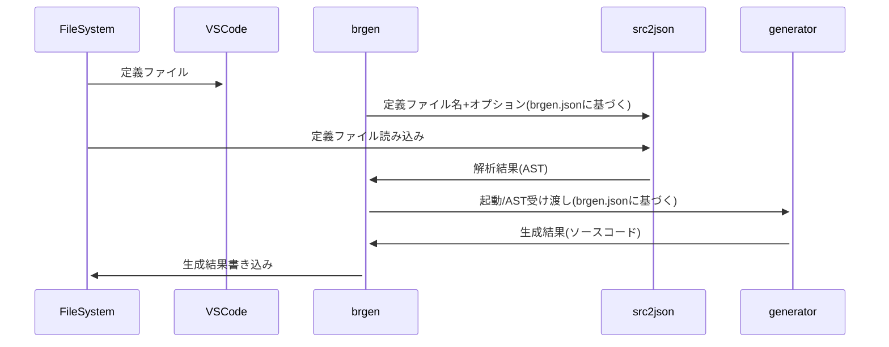

# Overview

brgen はバイナリパーサジェネレーター、およびその定義言語、ジェネレーター開発ツールの総称です。

以下 brgen(gen)をジェネレーター(正確にはジェネレータードライバー)、brgen(lang)を定義言語、brgen(tool)を開発ツールのこととして記載しています。

brgen(gen) はネットワークプロトコルやファイルフォーマットのバイナリエンコーダー/デコーダーを自動生成するためのツールです。
brgen(gen) は正確にはジェネレータードライバーといって、設定ファイル(brgen.json)にしたがって適切な brgen(lang)パーサーを呼び出し、その結果をジェネレーターに渡し、さらにその結果をファイルに書き込むというプログラムです。

brgen(CLI)

VSCode Extension


