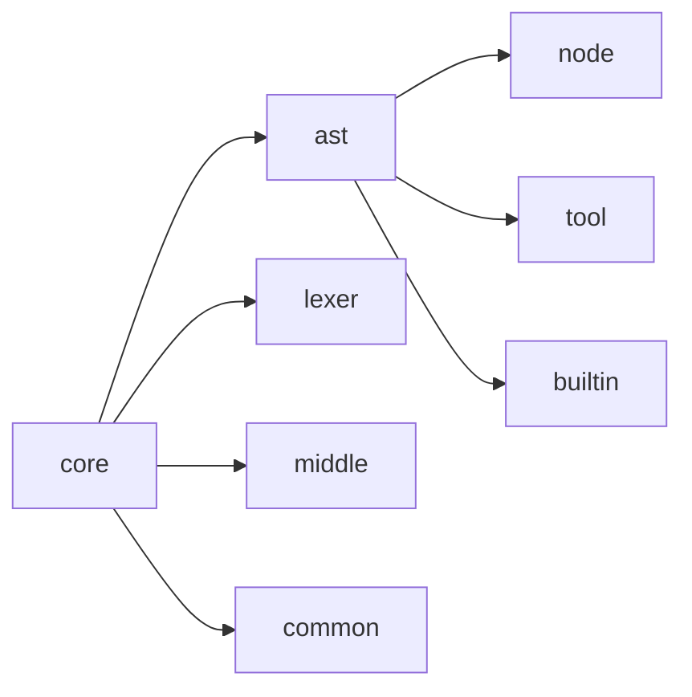
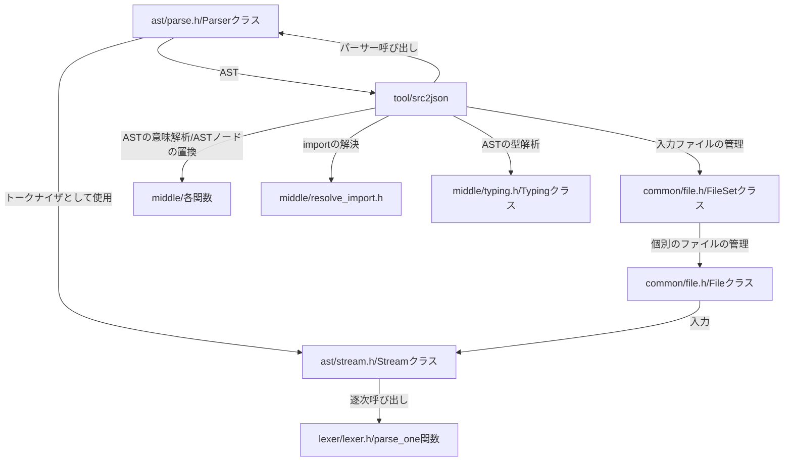

# Source(Core)

このページでは [開発ページの src/core ディレクトリ](https://github.com/on-keyday/brgen/tree/main/src/core)の中身の説明を行う

src/core ディレクトリには brgen(lang)の解析のコアとなる部分が入っている。

TODO(on-keyday): 説明を加える



AST 解析プログラム = tool/src2json は以上を以下のような関係で使っている



## 開発者メモ

### StructType を make_shared している箇所

- Program
- IndentBlock
- ScopedStatement(match の=>の右側)
- BuiltinObject

### StructType を使っている箇所とそのときの base の型

- ファイル全体 base: Program
- match の =>/: のノード base: MatchBranch
- if/elif/else のノード base: If
- for のノード base: For
- format のノード base: Format
- state のノード base: State
- fn のノード base: Function
- builtin のノード base: BuiltinObject

### Scope の切り替わり箇所とそのときの owner の型

- ファイル全体 owner: Program
- match の条件節 owner: Match
- match の =>/: のノード owner: MatchBranch
- if/elif/else のノード owner: If
- if/elif の条件節 owner: If
- for のノード owner: For
- for の条件節 owner: For
- format のノード base: Format
- state のノード base: State
- fn のノード base: Function

### Ident.base の設定箇所とそのときの base の型

- union 型 field のノード base: Field
- field のノード base: Field
- assign のノード base: Binary
- enum のノード base :Enum
- enum メンバーのノード base: EnumMember
- format のノード base: Format
- state のノード base: State
- fn のノード base: Function
- builtin のノード base: BuiltinMember
- member_access のメンバー識別子 base: MemberAccess
- typing/typing_ident で行われる型付け base: Ident

### その他メモ

- 型名の識別子(Ident)の expr_type は nullptr

```brgen
format A: <--ここの識別子や
    ..

A # <--ここの識別子のexpr_typeはnullptr
```

- Typing クラス実装時 StructType を不用意に用いると木構造が再帰して木構造でなくなる場合があるので注意。代わりに IdentType を用いること。
- IdentType の base は IdentType にならないようにすること。


