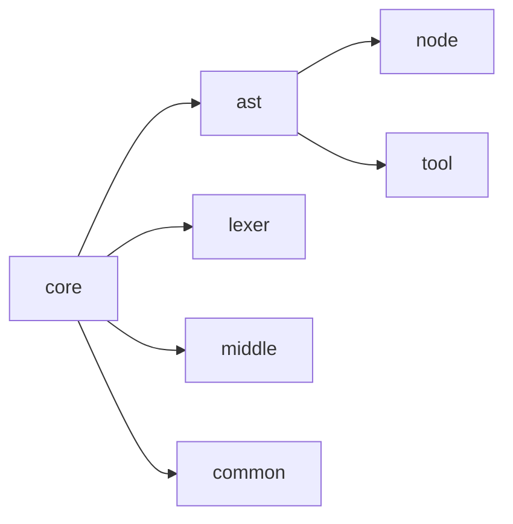

# Source(Core)

このページでは [開発ページの src/core ディレクトリ](https://github.com/on-keyday/brgen/tree/main/src/core)の中身の説明を行う

src/core ディレクトリには brgen(lang)の解析のコアとなる部分が入っている。

TODO(on-keyday): 説明を加える

```mermaid
flowchart LR
core-->ast
ast-->node
ast-->tool
core-->lexer
core-->middle
core-->common
```


