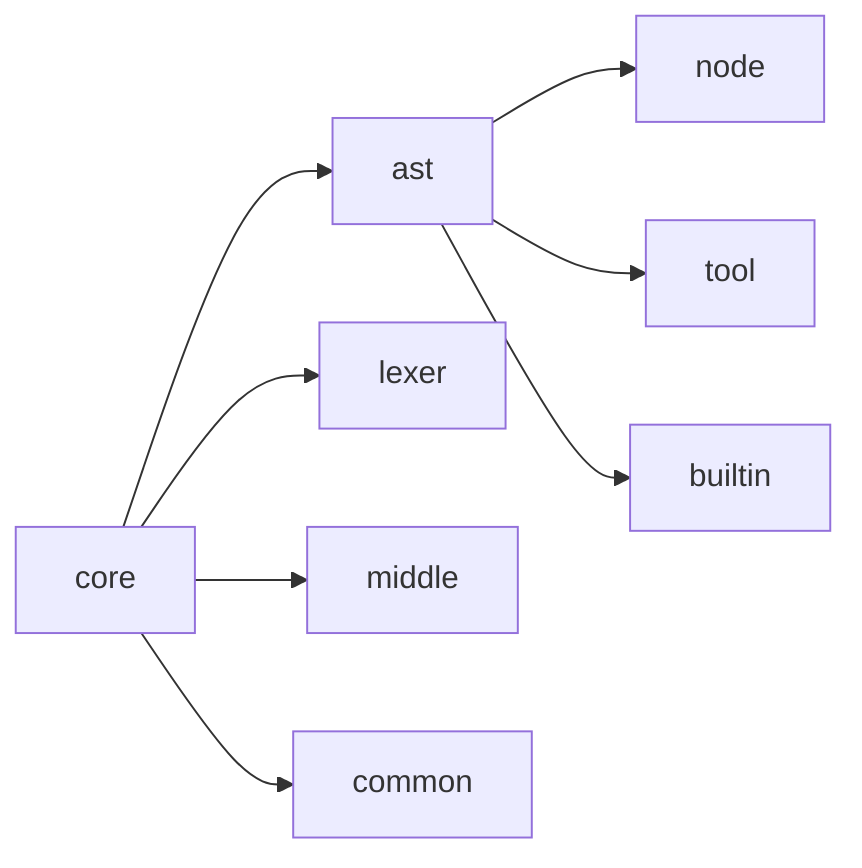
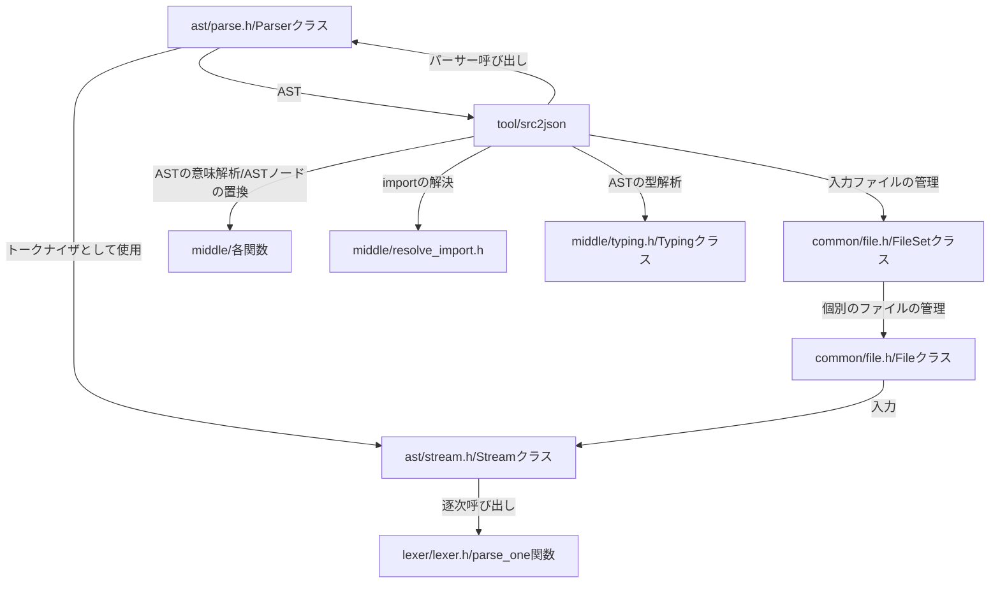

# Source(Core)

このページでは [開発ページの src/core ディレクトリ](https://github.com/on-keyday/brgen/tree/main/src/core)の中身の説明を行う

src/core ディレクトリには brgen(lang)の解析のコアとなる部分が入っている。



- src/core/ast - brgen の AST の関係のツール
- node - AST ノードの定義
  - base.h - Node クラスや Comment 等ベースとなるクラス群
  - expr.h - 式関係のクラス。Ident はここにある。
  - literal.h - 式関係の中でリテラル値のクラス。
  - statement.h -　 loop とか format 等のステートメント。Member 系もここにある。
  - type.h - 型関係のクラス
  - scope.h - 識別子のスコープ管理クラスの定義

TODO(on-keyday): 説明を書く...

AST 解析プログラム = tool/src2json は以上を以下のような関係で使っている



## AST について

### AST 全般について

現状、AST の大本の定義は src/core/ast/node 内のファイルにある C++構造体の定義群である。
AST の種類一覧は src/core/ast/node/node_type.h がわかりやすい。
他の言語の AST は src/core/ast/node_type_list.h にある変換ルールに従って C++構造体の定義から json に変換されたのち、
src/tool/gen/gen.go のロジックによって読み込まれ、src/tool/gen ディレクトリ内のアプリケーション達によって
各言語に変換される。json は`tool/src2json --dump-types`コマンドを使用するすることで取得できる。
なお、AST の全体図は[AST](https://on-keyday.github.io/brgen/doc/docs/ast)ページに存在する。

すべての AST ノードは Node を継承する。
継承関係については先程のリンクを参照。

brgen(lang)の AST は一旦構文解析フェーズで基本的なノードとしてパースした後、
意味解析フェーズで必要に応じて別のノードに変換するようになっている。
src/core/ast/node/translate.h には変換される先のノードが入っているので参考にされたし。

### 未使用要素について

現在存在だけしているが未使用だったり非推奨になっている機能を挙げる

- TmpVar ノード
- Builtin\*ノード
- OptionalType ノード
- GenericType ノード

### Loc について

- lexer::Loc::pos の各フィールドはソースコード上の 0 オリジンでのオフセットを表す
- lexer::Loc::file は AstFile や TokenFile の file プロパティでの index+1 を表す。0 はソースコード由来でない(ビルトイン関数等)ことを表す。0 の場合、他のフィールドは意味を持たない
- lexer::Loc::line はソースコードの行を 1 オリジンで表す
- lexer::Loc::col はソースコードの列を 1 オリジンで表す
- pos や line,col は src2json の--interpret-mode に影響を受ける。たとえば入力が UTF-8 ファイルだったとしても、utf16 を指定すればそのように解釈する。これは JavaScript 環境など文字が UTF-16 前提の環境などでエラー表示や色付けなどのずれを防いだりするのに使われている

### Ident について

- Ident は識別子一般を表す。識別子は変数名、フィールド名、フォーマット名、列挙体名、ステート名、メンバーアクセスなどすべての識別子を含む。
- Ident.ident は識別子の文字列表現を表す
- Ident.scope は識別子の使用されているスコープを表す
- Ident.usage は識別子の使用の目的を表す
- Ident.base は識別子の定義元への参照を表す。以下の型のパターンがありえる。

  - null -　未解決の参照
  - Ident - 定義元識別子への参照。IdentUsage が`reference`で始まる。した２つ
  - MemberAccess - メンバーへのアクセス経由での参照。MemberAccess.base が定義元識別子への参照になる
  - 上記 2 つは以下のいづれかを指す Ident.base を持った Ident への参照を保持する。そうでない場合それはバグである。
  - Binary - 代入演算への参照。この場合変数が`:=`や`::=`演算子を使って定義されたことを表す
  - Field - フィールドへの参照
  - Format - フォーマットへの参照
  - Enum - 列挙体への参照
  - EnumMember - 列挙体メンバへの参照
  - Function - 関数への参照
  - State - ステートへの参照

## 開発者メモ

### StructType を make_shared している箇所

- Program
- IndentBlock
- ScopedStatement(match の=>の右側)
- BuiltinObject

### StructType を使っている箇所とそのときの base の型

- ファイル全体 base: Program
- match の =>/: のノード base: MatchBranch
- if/elif/else のノード base: If
- for のノード base: For
- format のノード base: Format
- state のノード base: State
- fn のノード base: Function
- builtin のノード base: BuiltinObject

### Scope の切り替わり箇所とそのときの owner の型

- ファイル全体 owner: Program
- match の条件節 owner: Match
- match の =>/: のノード owner: MatchBranch
- if/elif/else のノード owner: If
- if/elif の条件節 owner: If
- for のノード owner: For
- for の条件節 owner: For
- format のノード base: Format
- state のノード base: State
- fn のノード base: Function

### Ident.base の設定箇所とそのときの base の型

- union 型 field のノード base: Field
- field のノード base: Field
- assign のノード base: Binary
- enum のノード base :Enum
- enum メンバーのノード base: EnumMember
- format のノード base: Format
- state のノード base: State
- fn のノード base: Function
- builtin のノード base: BuiltinMember
- member_access のメンバー識別子 base: MemberAccess
- typing/typing_ident で行われる型付け base: Ident

### 新しいノード/列挙型を追加するときの注意事項

- 現在新しいノードは C++のコードを変更することで追加する。将来的には JSON による定義をすべての基礎にしたいが、現状いろいろこんがらがっているので C++コードの変更で対処する
- 以下変更を要する部分を述べる
- ast/node_type.h/NodeType - NodeType 型(enum)にノードのタイプを追加。C++ではキャストを行う際、この型をビット演算してどの派生クラスかを判定している(dynamic_cast は遅いので)ため、それに合った位置に追加する。また新規に基底型を追加する際は、0xFF0000 部分を他の基底とかぶらないように(そしてその基底型が別の型から派生している場合はそのマスクも満たすように)設定する。
- ast/node_type.h/node_type_str_array - NodeType と文字列のマッピングを追加する。これを追加しないと、コードジェネレーターがノードを認識してくれないので注意。
- ast/node/各ファイル - ノード自体の定義を書く。define_node_type(NodeType::<ノードを示す値>)の定義を先頭に書く。コンストラクタで適切な NodeType を設定する必要がある。デフォルトコンストラクタは必須である。
- ast/traverse.h/get_node - SWITCH 内に CASE(ノード型)を設定する。なお順序はどうでもいいのだが、できれば同じ種類でまとまっておいたほうが良い。
- ast/ast.h/as - もし、新たな基底型を追加する場合は、場合分け(Expr や Type のある部分)にその基底を追加する
- ast/node_type_list.h/do_dump - もし列挙型を追加する場合は他の列挙型と同じように追加する。

### その他メモ

- 型名の識別子(Ident)の expr_type は nullptr
  - import された型についても同様

```brgen
format A: <--ここの識別子や
    ..

A # <--ここの識別子のexpr_typeはnullptr
```

- Typing クラス実装時 StructType を不用意に用いると木構造が再帰して木構造でなくなる場合があるので注意。代わりに IdentType を用いること。
- IdentType の base は IdentType にならないようにすること。


